# Unidad 0 — Apunte de Aprendizaje Automático 1

> **Apunte oficial de la cátedra**, elaborado por el **Esp. Ing. Joel Spak** (Agosto 2025).

## Sobre esta unidad

Esta unidad se cursa como **Unidad 0** de la materia y tiene como objetivo **reforzar y profundizar los contenidos de Fundamentos de las Ciencias de Datos**, vista en cuatrimestres anteriores.

A lo largo de la carrera se adquieren los fundamentos de:

- Programación en Python.
- Estadística descriptiva e inferencial.
- Algebra lineal y cálculo.
- Probabilidad.

En Aprendizaje Automático 1 damos por sentadas esas bases y nos concentramos en los **algoritmos, métricas, y prácticas de modelado**. Si notás que algo de la estadística, el álgebra o la programación te queda flojo, este es el momento de **reforzarlo por tu cuenta** — la materia avanza rápido y no tenemos tiempo de repasar esos temas en clase.

### ¿Qué vas a encontrar en este apunte?

El apunte recorre **10 temas** que cubren los algoritmos clásicos y modernos del aprendizaje supervisado, las métricas, el balanceo de clases, la explicabilidad, el ajuste fino, una introducción a redes neuronales y los fundamentos de MLOps. Está pensado como **material de consulta** durante la cursada: no es un libro de texto, sino un mapa del terreno.

> *El PDF original del apunte está disponible en la carpeta Drive de la materia (ver la página de inicio). El código asociado a los ejemplos está en el [repositorio de la cátedra](https://github.com/joelspak/TUIA-Aprendizaje-Automatico-1).*

---

## Índice

1. [Introducción al aprendizaje automático](#1-introducción-al-aprendizaje-automático)
2. [Modelos lineales para regresión](#2-modelos-lineales-para-regresión)
3. [Modelos lineales para clasificación](#3-modelos-lineales-para-clasificación)
4. [Métricas para clasificación](#4-métricas-para-clasificación)
5. [Balanceo de clases](#5-balanceo-de-clases)
6. [Explicabilidad de modelos](#6-explicabilidad-de-modelos)
7. [Comparación de modelos y ajuste fino](#7-comparación-de-modelos-y-ajuste-fino)
8. [Ajuste fino](#8-ajuste-fino)
9. [Introducción a redes neuronales](#9-introducción-a-redes-neuronales)
10. [MLOps](#10-mlops)
11. [Bibliografía](#bibliografía)

---

## 1. Introducción al aprendizaje automático

### 1.1. El aprendizaje como rama de la IA

**Inteligencia Artificial (IA)** es la disciplina que estudia cómo construir sistemas capaces de realizar tareas que, cuando las hace un humano, requieren inteligencia. Es un paraguas muy amplio.

El **Aprendizaje Automático** (*Machine Learning*, ML) es una subdisciplina de la IA: en lugar de programar reglas explícitas, dejamos que el sistema **aprenda** esas reglas a partir de **datos**.

Cuando los datos son **etiquetados** (es decir, conocemos la respuesta "correcta" para cada ejemplo) hablamos de **aprendizaje supervisado**. Si no hay etiquetas, hablamos de **aprendizaje no supervisado**. Y si el sistema aprende por **ensayo y error** interactuando con un entorno, hablamos de **aprendizaje por refuerzo**.

### 1.2. Aprendizaje supervisado, no supervisado y por refuerzo

**Aprendizaje supervisado:** tenemos pares $(x_i, y_i)$ y queremos aprender una función $f$ que mapee entradas a salidas. Si la salida $y$ es un número continuo hablamos de **regresión**; si $y$ pertenece a un conjunto discreto de categorías hablamos de **clasificación**.

**Aprendizaje no supervisado:** sólo tenemos $x_i$, sin etiquetas. Buscamos estructura en los datos. Los dos casos típicos son:

- **Clustering:** agrupar ejemplos similares (segmentación de clientes, agrupamiento de documentos).
- **Detección de anomalías:** identificar observaciones que se alejan del comportamiento "normal" (fraude, fallas industriales).

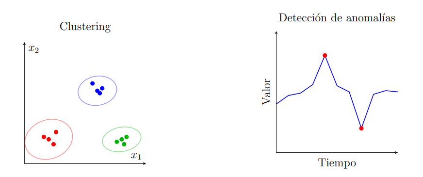
*Figura 2: Ejemplos de tareas no supervisadas. A la izquierda, clustering: tres grupos claramente separados. A la derecha, detección de anomalías: dos puntos que se apartan del patrón general en una serie temporal.*

**Aprendizaje por refuerzo:** un *agente* toma decisiones en un *entorno* y recibe *recompensas*. El objetivo es aprender una *política* que maximice la recompensa acumulada a lo largo del tiempo. Ejemplos: juegos, robótica, sistemas de recomendación.

### 1.3. Tipos de tareas en aprendizaje supervisado

En el contexto de la materia nos concentraremos en aprendizaje supervisado.

- **Regresión:** la variable objetivo es continua. Ejemplos: predecir el precio de una casa, la temperatura de mañana, la demanda de un producto.
- **Clasificación binaria:** la variable objetivo toma uno de dos valores. Ejemplos: spam/no-spam, fraude/no-fraude, enfermo/sano.
- **Clasificación multiclase:** la variable objetivo toma uno de $K > 2$ valores. Ejemplos: clasificar dígitos del 0 al 9, clasificar tipos de flores.
- **Clasificación multi-etiqueta:** cada ejemplo puede tener más de una etiqueta simultáneamente. Ejemplo: clasificar una imagen como "playa" y "atardecer" al mismo tiempo.

### 1.4. Ciclo de vida de un proyecto de ML

Un proyecto de ML no se reduce a "entrenar un modelo". Tiene varias etapas:

1. **Definición del problema.** ¿Qué queremos predecir? ¿Qué métrica de éxito usaremos? ¿Qué decisiones se tomarán a partir de las predicciones?
2. **Recolección y exploración de datos.** ¿De dónde vienen los datos? ¿Qué calidad tienen? ¿Hay sesgos?
3. **Preprocesamiento y feature engineering.** Limpieza, normalización, encoding de variables categóricas, construcción de nuevas features.
4. **División de los datos.** Train / validation / test. Es crucial que el conjunto de test refleje los datos que el modelo verá en producción.
5. **Entrenamiento del modelo.** Ajuste de parámetros minimizando una función de pérdida sobre el train set.
6. **Evaluación.** Comparación de modelos sobre el validation set. Ajuste de hiperparámetros.
7. **Evaluación final.** Una sola vez, sobre el test set. Esta métrica es nuestro mejor estimado del desempeño en producción.
8. **Despliegue y monitoreo.** Poner el modelo en producción y monitorear su desempeño en el tiempo.

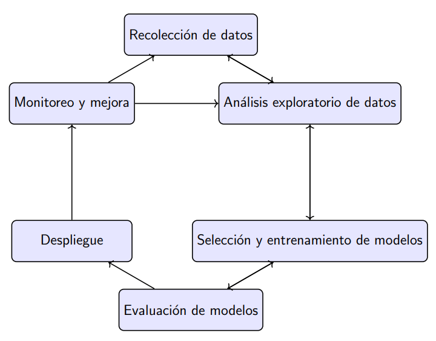
*Figura 3: Ciclo de vida de un proyecto de Machine Learning. La etapa de monitoreo y mejora cierra el loop, alimentando nuevas iteraciones del proceso.*

### 1.5. Componentes de un algoritmo de aprendizaje

Un algoritmo de aprendizaje supervisado tiene tres componentes:

- **Función de hipótesis** (o modelo): la familia de funciones $f_\theta(x)$ que el algoritmo puede aprender. Ejemplo: una recta $f(x) = wx + b$, una red neuronal, un árbol de decisión.
- **Función de pérdida** (*loss function*): mide qué tan mal lo está haciendo el modelo en un ejemplo particular. Ejemplos: error cuadrático medio para regresión, *log-loss* para clasificación.
- **Optimizador:** el procedimiento que ajusta los parámetros $\theta$ para minimizar la pérdida agregada sobre los datos de entrenamiento. Ejemplo: gradiente descendiente.

### 1.6. Evaluación de modelos de aprendizaje

Un modelo se evalúa con datos **que no vio durante el entrenamiento**. De lo contrario, estaríamos midiendo la capacidad de **memorizar**, no de **generalizar**.

La estrategia estándar es dividir los datos disponibles en tres conjuntos:

- **Train set** (típicamente 60-80%): usado para ajustar los parámetros del modelo.
- **Validation set** (típicamente 10-20%): usado para comparar modelos y elegir hiperparámetros.
- **Test set** (típicamente 10-20%): usado **una sola vez** al final, para estimar el desempeño en producción.

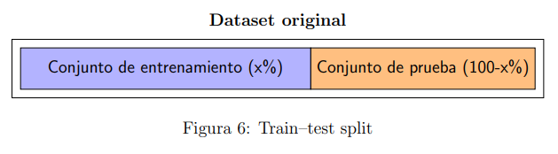
*Figura 6: Train-test split. Se reserva un porcentaje de los datos (test) que el modelo nunca ve durante el entrenamiento y se usa exclusivamente para estimar el desempeño final.*

Cuando los datos son escasos se usa **validación cruzada** (*k-fold cross-validation*): se particionan los datos en $k$ bloques y se rotan como train/validation $k$ veces, promediando el resultado.

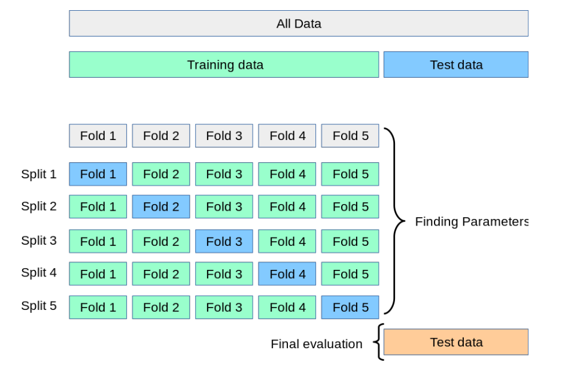
*Figura 7: Validación cruzada de 5 folds. Cada split usa un fold distinto como validation y los otros cuatro como train. El test set queda aparte para la evaluación final.*

### 1.7. Fuga de datos (*data leakage*)

**Fuga de datos** ocurre cuando información del conjunto de test (o de validación) "se filtra" al proceso de entrenamiento, ya sea a través de los datos mismos o del preprocesamiento. Esto produce estimaciones de desempeño **artificialmente infladas** que no se replican en producción.

Ejemplos comunes:

- Escalar (*scaling*) usando estadísticas calculadas sobre todo el dataset, en lugar de calcularlas sólo sobre el train set.
- Hacer selección de features mirando el test set.
- Tener filas duplicadas o casi duplicadas que aparecen en train y en test.
- Usar variables que en producción no estarán disponibles (variables "proxy" del futuro).

La forma más segura de evitar fugas es **encapsular todo el preprocesamiento dentro de un pipeline** que se entrena con `fit` sólo sobre el train set y luego se aplica con `transform` al test set.

---

## 2. Modelos lineales para regresión

### 2.1. Regresión lineal simple

Tenemos una variable predictora $x$ y queremos predecir una variable respuesta $y$ continua. El modelo más simple es una recta:

$$
\hat{y} = w x + b
$$

donde $w$ es la **pendiente** y $b$ es la **ordenada al origen**. Dados los datos $\{(x_i, y_i)\}_{i=1}^n$, queremos encontrar los valores de $w$ y $b$ que mejor se ajusten.

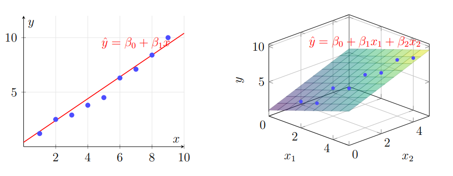
*Figura 8: Izquierda, regresión lineal simple $\hat{y} = \beta_0 + \beta_1 x$ en 2D. Derecha, regresión lineal múltiple $\hat{y} = \beta_0 + \beta_1 x_1 + \beta_2 x_2$ en 3D, donde el modelo ajusta un plano a los puntos.*

La calidad del ajuste se mide con el **error cuadrático medio** (MSE):

$$
L(w, b) = \frac{1}{n} \sum_{i=1}^n (y_i - \hat{y}_i)^2
$$

La solución analítica (cuando existe inversa) viene de las **ecuaciones normales**:

$$
\hat{\mathbf{w}} = (X^T X)^{-1} X^T \mathbf{y}
$$

### 2.2. Regresión lineal múltiple

Generalizamos a $d$ variables predictoras:

$$
\hat{y} = w_1 x_1 + w_2 x_2 + \dots + w_d x_d + b = \mathbf{w}^T \mathbf{x} + b
$$

En notación matricial, con $X$ una matriz de tamaño $n \times (d+1)$ (con una columna de 1s para el sesgo), la solución es la misma:

$$
\hat{\mathbf{w}} = (X^T X)^{-1} X^T \mathbf{y}
$$

La interpretación de cada $w_j$ es: manteniendo todas las demás variables fijas, cuánto cambia $\hat{y}$ cuando $x_j$ aumenta en una unidad.

### 2.3. Métricas para regresión

- **MSE** (*Mean Squared Error*): $ \frac{1}{n} \sum (y_i - \hat{y}_i)^2 $. Penaliza mucho los errores grandes.
- **RMSE** (*Root MSE*): $\sqrt{\text{MSE}}$. Tiene la misma unidad que $y$.
- **MAE** (*Mean Absolute Error*): $ \frac{1}{n} \sum |y_i - \hat{y}_i| $. Más robusto a outliers.
- **$R^2$** (coeficiente de determinación): $1 - \frac{\sum (y_i - \hat{y}_i)^2}{\sum (y_i - \bar{y})^2}$. Proporción de varianza explicada. Vale 1 para un modelo perfecto y puede ser negativo para modelos muy malos.

### 2.4. Gradiente descendiente

Cuando $X^T X$ no es invertible, o cuando $d$ y $n$ son muy grandes, no podemos (o no queremos) usar la solución analítica. En su lugar usamos **gradiente descendiente**:

$$
\mathbf{w} \leftarrow \mathbf{w} - \eta \nabla L(\mathbf{w})
$$

donde $\eta$ es la **tasa de aprendizaje** (*learning rate*) y $\nabla L$ es el gradiente de la pérdida respecto a $\mathbf{w}$.

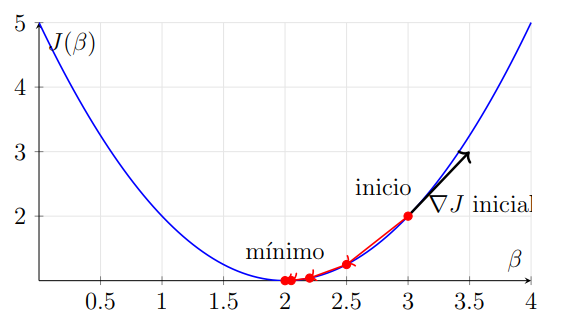
*Figura 9: Ilustración del gradiente descendiente sobre una función de pérdida $J(\beta)$ convexa. A partir de un punto inicial, cada paso se mueve en dirección opuesta al gradiente $\nabla J$ hasta converger al mínimo.*

Para el MSE, el gradiente es:

$$
\nabla_{\mathbf{w}} L = -\frac{2}{n} X^T (\mathbf{y} - X \mathbf{w})
$$

La elección de $\eta$ es crítica: si es muy chico, el entrenamiento es innecesariamente lento; si es muy grande, el algoritmo **diverge** o **oscila**.

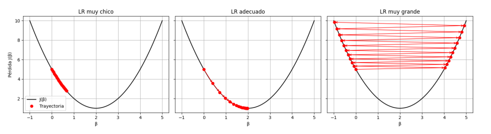
*Figura 10: Tres regímenes de learning rate. Izquierda: LR muy chico converge muy lento y se "estanca". Centro: LR adecuado, converge rápido y suave al mínimo. Derecha: LR muy grande, la trayectoria oscila y diverge.*

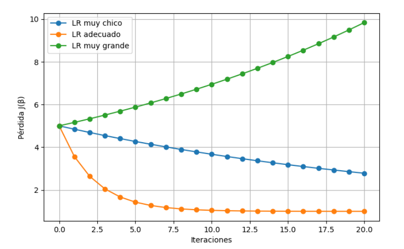
*Figura 11: Evolución de la pérdida en función de las iteraciones. Con LR adecuado (naranja) la pérdida cae rápido y se estabiliza. Con LR muy chico (azul) baja muy lento. Con LR muy grande (verde) la pérdida crece o diverge.*

Existen variantes: **batch** (usa todo el dataset), **estocástico** (usa un ejemplo por iteración), y **mini-batch** (usa un subconjunto pequeño). Las más usadas en la práctica son las variantes con **momentum** y **Adam**.

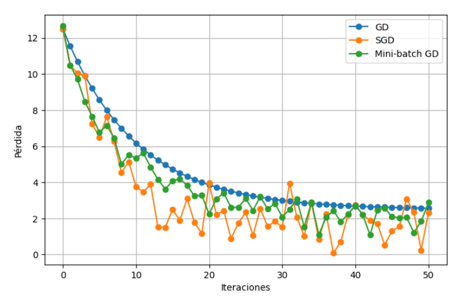
*Figura 12: Trayectorias de la pérdida para gradiente descendiente batch (GD), estocástico (SGD) y mini-batch. GD es suave y lento; SGD es ruidoso pero avanza rápido por iteración; mini-batch es un compromiso entre ambos.*

### 2.5. Regularización

Cuando el modelo sobreajusta (*overfit*) — buen desempeño en train, malo en test — una herramienta clásica es **penalizar** la magnitud de los pesos. Dos regularizadores habituales:

- **L2 (Ridge):** $\lambda \sum_j w_j^2$. Tiende a llevar los pesos a valores pequeños pero no necesariamente a cero.
- **L1 (Lasso):** $\lambda \sum_j |w_j|$. Tiende a llevar muchos pesos a exactamente cero, haciendo **selección de features** implícita.
- **Elastic Net:** combinación convexa de L1 y L2: $\lambda_1 \|w\|_1 + \lambda_2 \|w\|_2^2$.

El hiperparámetro $\lambda$ controla la fuerza de la regularización y se elige por validación cruzada.

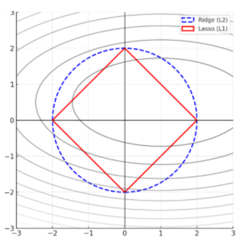
*Figura 13: Comparación geométrica de Ridge (L2, círculo) y Lasso (L1, rombo) sobre los contornos de la función de pérdida. La solución regularizada es el primer punto donde el contorno de la pérdida toca la región de restricción. Con L1 ese punto cae típicamente sobre un eje, llevando pesos a cero.*

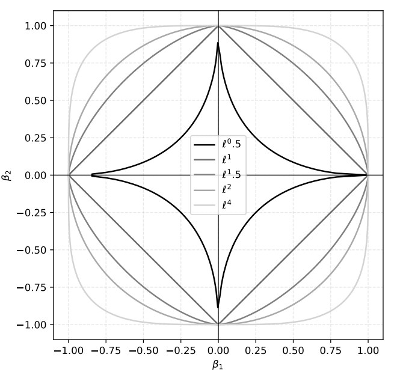
*Figura 14: Contornos de la norma $\ell^p$ para $p \in \{0.5, 1, 1.5, 2, 4\}$. A medida que $p$ crece, los contornos se "redondean" pasando del rombo (L1) al círculo (L2). En el límite $p \to 0$ se recupera la pseudo-norma $\ell^0$, que cuenta entradas no nulas y produce soluciones dispersas.*

---

## 3. Modelos lineales para clasificación

### 3.1. Clasificación binaria vs multiclase

En clasificación **binaria** la variable objetivo $y$ toma valores en $\{0, 1\}$ (o $\{-1, +1\}$). En clasificación **multiclase** toma valores en $\{1, 2, \dots, K\}$ con $K > 2$.

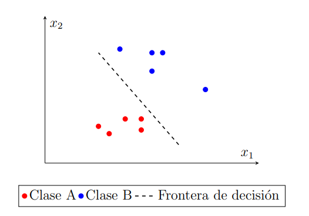
*Figura 1: Problema de clasificación binaria en 2D. Los puntos azules (Clase A) y rojos (Clase B) son separables por una frontera lineal (la recta punteada). El modelo aprende dónde trazar esa frontera.*

### 3.2. La regresión lineal como clasificador (y por qué no alcanza)

Una idea naive: ajustar una regresión lineal y usar un umbral sobre $\hat{y}$ (por ejemplo, clasificar como 1 si $\hat{y} \geq 0.5$, como 0 si no). Problemas:

- La salida $\hat{y}$ no está acotada: puede tomar valores como $1.7$ o $-0.3$, que no se interpretan como probabilidades.
- Es muy sensible a *outliers* y a la elección del umbral.
- No modela bien la naturaleza discreta de la variable objetivo.

Necesitamos un modelo cuya salida esté en $[0, 1]$.

### 3.3. Regresión logística

La **regresión logística** es el modelo lineal de clasificación por excelencia. Mantenemos la combinación lineal $\mathbf{w}^T \mathbf{x} + b$ pero la pasamos por la **función sigmoide** (o *logística*):

$$
\sigma(z) = \frac{1}{1 + e^{-z}}
$$

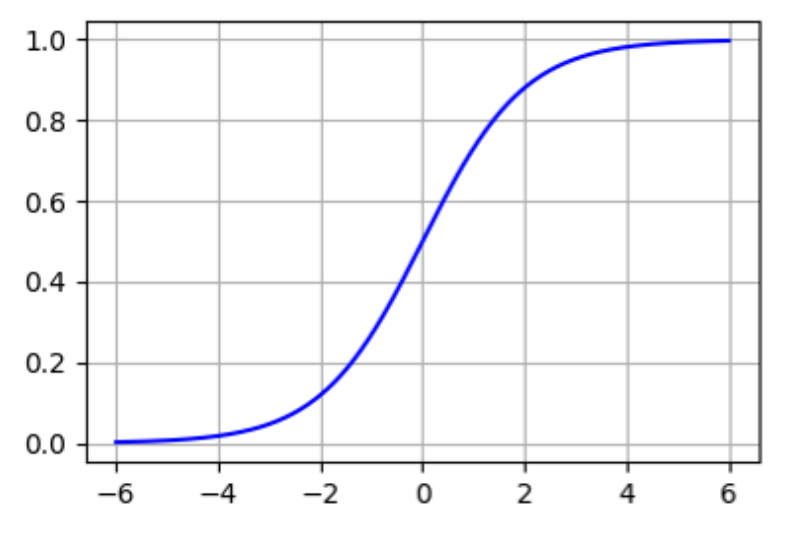
*Figura 15: La función sigmoide $\sigma(z) = 1/(1+e^{-z})$ mapea $\mathbb{R}$ en $(0, 1)$, es monótona creciente y satisface $\sigma(0) = 1/2$, $\sigma(-z) = 1 - \sigma(z)$. Es la inversa del logit.*

De modo que el modelo predice la **probabilidad** de que $y = 1$:

$$
P(y = 1 \mid \mathbf{x}) = \sigma(\mathbf{w}^T \mathbf{x} + b) = \frac{1}{1 + e^{-(\mathbf{w}^T \mathbf{x} + b)}}
$$

La función sigmoide es monótona creciente, tiene rango $(0, 1)$ y satisface $\sigma(-z) = 1 - \sigma(z)$, lo que la hace muy conveniente para modelar probabilidades.

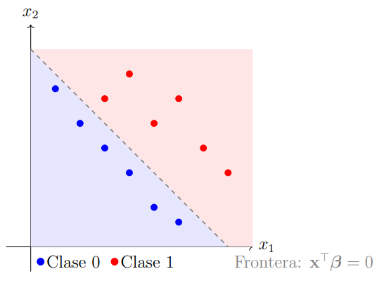
*Figura 16: Ejemplo de regresión logística en 2D. La frontera de decisión es el conjunto de puntos donde $\mathbf{x}^\top \boldsymbol{\beta} = 0$, es decir, donde la probabilidad predicha vale exactamente $1/2$. A un lado, la clase 0; al otro, la clase 1.*

### 3.4. Chances (*odds*)

Las **chances** (*odds*) de un evento se definen como el cociente entre la probabilidad de que ocurra y la probabilidad de que no ocurra:

$$
\text{odds}(y = 1 \mid \mathbf{x}) = \frac{P(y = 1 \mid \mathbf{x})}{P(y = 0 \mid \mathbf{x})} = \frac{p}{1 - p}
$$

Si $p = 0.5$, las chances son 1 a 1. Si $p = 0.8$, las chances son 4 a 1. Las chances van de $0$ a $\infty$.

### 3.5. Logaritmo de las chances (*log-odds* o *logit*)

Aplicamos logaritmo a las chances:

$$
\text{logit}(p) = \log \frac{p}{1 - p}
$$

La transformación *logit* mapea $(0, 1)$ en $(-\infty, \infty)$. Y, crucialmente, el **logit es la inversa de la sigmoide**: la regresión logística está modelando que

$$
\log \frac{p}{1 - p} = \mathbf{w}^T \mathbf{x} + b
$$

### 3.6. ¿Por qué se llama regresión logística?

Porque la combinación lineal $\mathbf{w}^T \mathbf{x} + b$ modela el *logit* de $p$, y la inversa de la función *logit* es la *sigmoide logística*. Aunque la llamamos "regresión", es un modelo de **clasificación**.

### 3.7. Estimación de los coeficientes

Se maximiza la **verosimilitud** de los datos observados, o equivalentemente se minimiza la **log-pérdida** (*log loss* o *binary cross-entropy*):

$$
L(\mathbf{w}, b) = -\frac{1}{n} \sum_{i=1}^n \left[ y_i \log \hat{p}_i + (1 - y_i) \log (1 - \hat{p}_i) \right]
$$

No tiene solución analítica cerrada, así que se usa **gradiente descendiente** (o variantes como L-BFGS, Newton-Raphson, etc.).

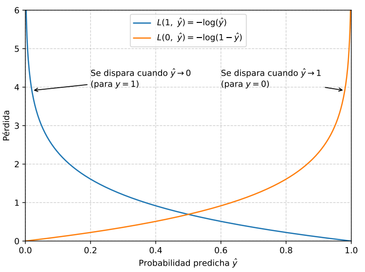
*Figura 17: Binary cross-entropy vista como dos curvas. Cuando la clase real es $y = 1$, la pérdida $L(1, \hat{y}) = -\log(\hat{y})$ se dispara cuando $\hat{y} \to 0$. Cuando la clase real es $y = 0$, la pérdida $L(0, \hat{y}) = -\log(1 - \hat{y})$ se dispara cuando $\hat{y} \to 1$. Es decir, el modelo paga caro cada vez que se equivoca con alta confianza.*

### 3.8. Problemas multiclase

Para $K > 2$ clases se generaliza con la **regresión softmax**:

$$
P(y = k \mid \mathbf{x}) = \frac{e^{\mathbf{w}_k^T \mathbf{x} + b_k}}{\sum_{j=1}^K e^{\mathbf{w}_j^T \mathbf{x} + b_j}}
$$

La función de pérdida pasa a ser la **cross-entropy categórica**:

$$
L = -\frac{1}{n} \sum_{i=1}^n \sum_{k=1}^K y_{i,k} \log \hat{p}_{i,k}
$$

donde $y_{i,k}$ es 1 si el ejemplo $i$ pertenece a la clase $k$ y 0 en caso contrario (*one-hot encoding*).

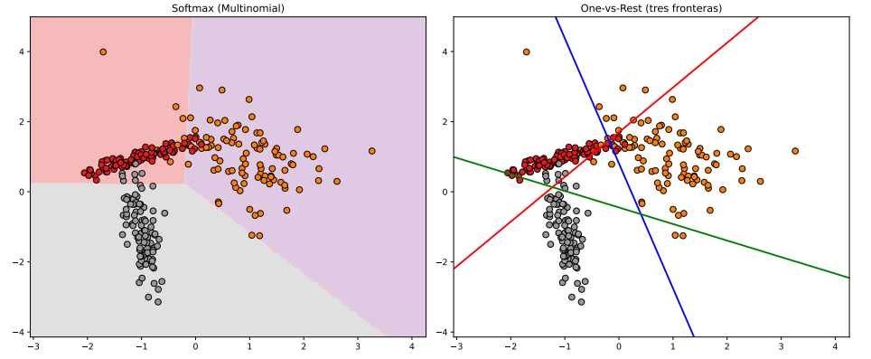
*Figura 18: Dos estrategias para clasificación multiclase. Izquierda, **softmax (multinomial)**: un único modelo con $K$ conjuntos de pesos que produce una partición del espacio en $K$ regiones coherentes. Derecha, **One-vs-Rest**: se entrena un clasificador binario por clase (uno por cada color) y se elige la clase con el score más alto. Las fronteras de One-vs-Rest no son consistentes entre sí.*

---

## 4. Métricas para clasificación

### 4.1. Matriz de confusión

Para clasificación binaria, la **matriz de confusión** es una tabla 2x2 con las cuentas:

|              | Predicho 0 | Predicho 1 |
|--------------|------------|------------|
| **Real 0**   | VN (TN)    | FP (FN si digo 1, era 0) → **FP** |
| **Real 1**   | FN (era 1, dije 0) → **FN** | VP (TP) |

- **VP (TP)**: Verdaderos Positivos. El modelo dijo 1 y era 1.
- **VN (TN)**: Verdaderos Negativos. El modelo dijo 0 y era 0.
- **FP (FP)**: Falsos Positivos. El modelo dijo 1 y era 0. *Error tipo I.*
- **FN (FN)**: Falsos Negativos. El modelo dijo 0 y era 1. *Error tipo II.*

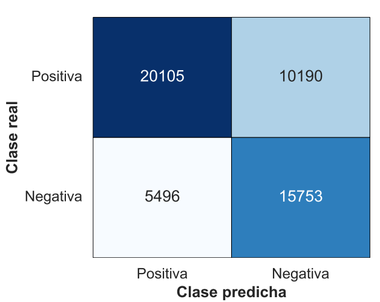
*Figura 19: Ejemplo real de matriz de confusión para un problema binario. Cada celda muestra la cantidad de ejemplos en esa categoría. La diagonal (VP y VN) son las predicciones correctas; la anti-diagonal (FP y FN) son los errores.*

### 4.2. Accuracy

$$
\text{accuracy} = \frac{VP + VN}{VP + VN + FP + FN}
$$

Proporción de predicciones correctas. **Engañosa con clases desbalanceadas**: si el 99% de los casos son negativos, un modelo que siempre dice "negativo" tiene 99% de accuracy.

### 4.3. Recall (*sensibilidad*, *TPR*)

$$
\text{recall} = \frac{VP}{VP + FN}
$$

De todos los positivos reales, ¿cuántos detecté? Mide la **cobertura** de la clase positiva. En problemas médicos suele ser la métrica más importante (preferimos un falso positivo a un falso negativo).

### 4.4. Precision

$$
\text{precision} = \frac{VP}{VP + FP}
$$

De todos los que predije como positivos, ¿cuántos eran realmente positivos? Mide la **calidad** de mis predicciones positivas.

### 4.5. F1-score

Media armónica de precision y recall:

$$
F_1 = 2 \cdot \frac{\text{precision} \cdot \text{recall}}{\text{precision} + \text{recall}}
$$

Vale 1 si ambas son 1, vale 0 si alguna es 0. Penaliza los modelos que están desbalanceados entre precision y recall. Es la métrica clásica cuando hay desbalance y queremos resumir en un solo número.

### 4.6. Promedios en clasificación multiclase

- **Macro avg**: se calcula la métrica por clase y se promedia (sin ponderar). Trata a todas las clases por igual.
- **Weighted avg**: se pondera cada clase por su frecuencia. Una clase muy frecuente domina.
- **Micro avg**: se calcula la métrica sobre el total de VP, FP, FN agregados. Equivale a la accuracy en multiclase.

### 4.7. Métricas personalizadas

A veces la métrica "correcta" depende del costo de cada tipo de error. Por ejemplo, en detección de fraude, un falso negativo (fraude no detectado) puede costar $1000 y un falso positivo (rechazar una transacción legítima) puede costar $5. En ese caso la métrica de negocio es:

$$
\text{costo total} = 1000 \cdot FN + 5 \cdot FP
$$

y queremos minimizarla directamente.

### 4.8. Curva ROC y AUC

La **curva ROC** grafica el *TPR* (recall) contra el *FPR* ($FP / (FP + TN)$) para **todos los umbrales posibles** de decisión. Cada modelo produce una curva en este espacio.

El **AUC** (*Area Under the Curve*) es el área bajo la curva ROC. Interpretaciones:

- Vale 1 para un clasificador perfecto.
- Vale 0.5 para un clasificador aleatorio.
- Es **invariante al umbral**: mide la **calidad del ranking** que produce el modelo, no la calidad de una decisión umbral específica.
- Equivale a la probabilidad de que, dado un par (positivo, negativo) elegido al azar, el modelo le asigne score mayor al positivo.

---

## 5. Balanceo de clases

En muchos problemas reales las clases están **desbalanceadas**: una clase (la "positiva") aparece con mucha menos frecuencia que la otra. Ejemplos: detección de fraude (fraudes son < 1% de las transacciones), detección de enfermedades raras, churn de clientes.

El desbalance genera problemas:

- La **accuracy** deja de ser una buena métrica.
- Los modelos tienden a predecir siempre la clase mayoritaria.
- El threshold 0.5 deja de ser razonable.

### 5.1. Estrategias a nivel de datos

- **Undersampling**: descartar ejemplos de la clase mayoritaria al azar. Pierde información.
- **Oversampling**: replicar ejemplos de la clase minoritaria. Riesgo de overfitting.
- **SMOTE** (*Synthetic Minority Oversampling Technique*): generar **ejemplos sintéticos** de la clase minoritaria interpolando entre vecinos cercanos. Es la técnica más popular.

### 5.2. Estrategias a nivel de modelo

- Asignar **pesos por clase** (*class weights*) en la función de pérdida: que un error en la clase minoritaria "cueste" más.
- Cambiar el **umbral de decisión** ($\neq 0.5$): mirar la curva precision-recall o ROC y elegir el umbral que optimiza la métrica de negocio.

### 5.3. Estrategias a nivel de métricas

- Usar **F1**, **F-beta**, **PR-AUC** (área bajo la curva precision-recall) en lugar de accuracy.
- Reportar la **matriz de confusión** y no sólo un número.

---

## 6. Explicabilidad de modelos

Un modelo "explicable" es uno cuyas predicciones podemos **interpretar**: entender por qué el modelo predijo lo que predijo. Esto importa por cuestiones regulatorias, éticas, de debugging y de confianza.

### 6.1. Modelos intrínsecamente interpretables

Algunos modelos son interpretables por construcción:

- **Regresión lineal / logística**: los coeficientes $w_j$ cuantifican el efecto de cada feature.
- **Árboles de decisión**: las reglas *if-then-else* son leíbles.
- **Listas de reglas** y **modelos lineales generalizados**.

### 6.2. Modelos de caja negra y técnicas post-hoc

Modelos como gradient boosting, SVM con kernels o redes neuronales son más difíciles de interpretar. Para ellos se usan técnicas post-hoc:

- **Importancia de features** (*permutation importance*, *impurity-based importance*): cuánto cae la métrica si permuto al azar los valores de una feature.
- **Partial Dependence Plots (PDP)**: muestran el efecto marginal de una (o dos) features sobre la predicción promedio.
- **SHAP** (*SHapley Additive exPlanations*): descompone la predicción de un ejemplo como suma de contribuciones de cada feature, basándose en valores de Shapley de teoría de juegos.
- **LIME** (*Local Interpretable Model-agnostic Explanations*): aproxima localmente el modelo con un modelo interpretable alrededor de la predicción de un ejemplo particular.

### 6.3. Cuidado con la interpretabilidad aparente

Coeficientes de una regresión lineal no siempre son "lo que parecen": pueden cambiar de signo, su importancia puede depender de la escala de las features, y no capturan **interacciones** entre variables.

---

## 7. Comparación de modelos y ajuste fino

### 7.1. *Baseline models*

Siempre hay que tener al menos un **modelo base** (*baseline*) contra el cual comparar:

- **Baseline trivial**: predecir la media (regresión) o la clase mayoritaria (clasificación).
- **Baseline clásico**: regresión logística, árbol de decisión, k-NN, naive Bayes.
- **Baseline "fuerte"**: gradient boosting (XGBoost, LightGBM, CatBoost), SVM, random forest.

Si nuestro modelo "complejo" no le gana al baseline en validación cruzada, **no值得我们** la complejidad.

### 7.2. Criterios para comparación

- **Métrica de validación** (la que el negocio prioriza).
- **Tiempo de entrenamiento** e **inferencia** (especialmente si vamos a producción con grandes volúmenes).
- **Robustez / estabilidad** entre *folds* de validación cruzada.
- **Interpretabilidad**.
- **Mantenibilidad**: ¿es fácil reentrenarlo cuando llegan datos nuevos? ¿Depende de infraestructura cara?

### 7.3. Sesgo vs varianza

El **sesgo** es el error por hacer suposiciones demasiado simples (underfitting). La **varianza** es el error por ser demasiado sensible a los datos de entrenamiento (overfitting).

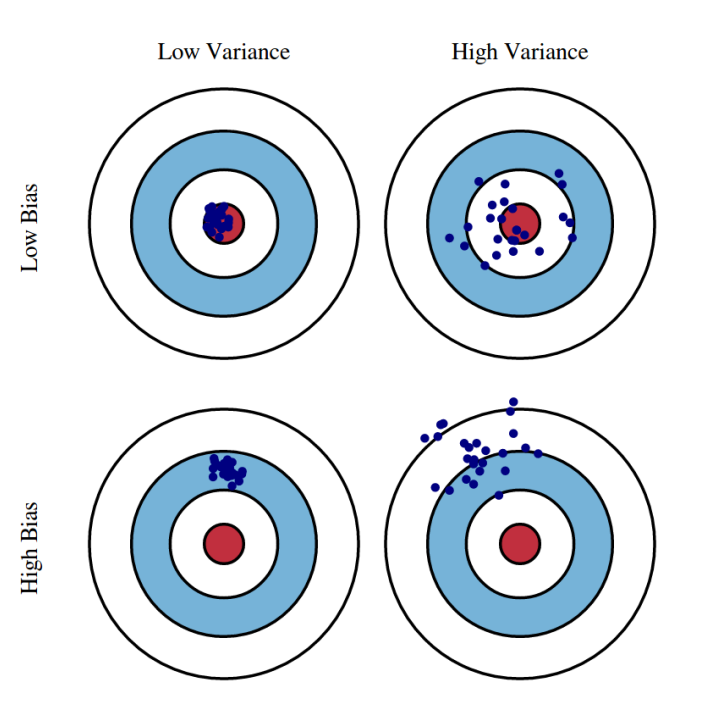
*Figura 4: Cuatro regímenes posibles de sesgo y varianza. La figura muestra dardos alrededor de un blanco (la verdad). Arriba-izquierda: bajo sesgo y baja varianza (modelo ideal). Arriba-derecha: bajo sesgo y alta varianza. Abajo-izquierda: alto sesgo y baja varianza. Abajo-derecha: alto sesgo y alta varianza.*

- Un modelo con **alto sesgo y baja varianza** (subajuste): anduvo mal en train, mal en test, similar en ambos.
- Un modelo con **bajo sesgo y alta varianza** (sobreajuste): anduvo muy bien en train, mal en test.

El objetivo es encontrar el balance: complejidad suficiente para capturar el patrón subyacente, pero no tanta como para memorizar ruido.

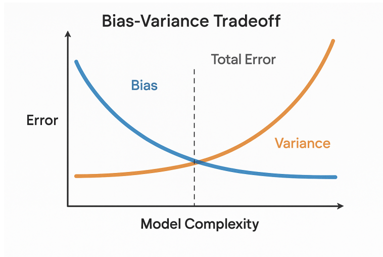
*Figura 5: Tradeoff sesgo-varianza en función de la complejidad del modelo. El error total es la suma del sesgo y la varianza. A medida que crece la complejidad, el sesgo baja pero la varianza sube. El óptimo está en el punto donde se minimiza el error total.*

---

## 8. Ajuste fino

### 8.1. Optimización de hiperparámetros

Los **hiperparámetros** son parámetros del algoritmo de aprendizaje que **no** se ajustan por gradiente descendiente: la profundidad máxima de un árbol, el número de vecinos en k-NN, la fuerza de regularización $\lambda$, etc.

Para elegirlos, no podemos usar el train set (sobreajustaríamos) ni el test set (lo "gastamos" como estimador final). Usamos el **validation set** o **validación cruzada**.

### 8.2. Métodos de búsqueda

- **Grid search**: probar todas las combinaciones de valores de una grilla predefinida. Simple pero costoso. Mejor cuando hay pocos hiperparámetros.
- **Random search**: muestrear combinaciones al azar. Sorprendentemente competitivo contra grid search en espacios de alta dimensionalidad, según Bergstra & Bengio (2012).
- **Bayesian optimization** (e.g. `Optuna`, `Hyperopt`, `scikit-optimize`): construir un modelo probabilístico de la función objetivo y elegir los próximos puntos a evaluar maximizando un criterio de *expected improvement*. Mucho más eficiente que grid/random.
- **Hyperband / BOHB**: métodos que combinan búsqueda con *early stopping* para descartar configuraciones malas rápidamente.

### 8.3. Validación cruzada anidada

Si usamos validación cruzada para ajustar hiperparámetros y volvemos a usar validación cruzada para estimar el desempeño, necesitamos **dos loops anidados** de CV. El loop interno elige los hiperparámetros, el loop externo estima el desempeño. Si no, la estimación de desempeño está **optimista**.

---

## 9. Introducción a redes neuronales

### 9.1. Motivación

Los modelos lineales (regresión lineal, regresión logística) tienen una limitación fundamental: sólo pueden aprender **fronteras lineales** en el espacio de features. Para problemas con relaciones no lineales necesitamos modelos más expresivos.

### 9.2. El perceptrón

El **perceptrón** es la unidad básica de una red neuronal. Calcula una combinación lineal de las entradas, le suma un sesgo y la pasa por una **función de activación** no lineal $\phi$:

$$
h = \phi\left( \sum_{j=1}^d w_j x_j + b \right) = \phi(\mathbf{w}^T \mathbf{x} + b)
$$

Funciones de activación comunes: sigmoide, tanh, ReLU ($\max(0, z)$), Leaky ReLU, GELU, Swish.

### 9.3. Perceptrón multicapa (*MLP*)

Un **MLP** es la composición de varias capas de perceptrones. Una capa "fully connected" con $m$ neuronas hace:

$$
\mathbf{h}^{(l)} = \phi\left( W^{(l)} \mathbf{h}^{(l-1)} + \mathbf{b}^{(l)} \right)
$$

con $W^{(l)} \in \mathbb{R}^{m \times d}$, donde $d$ es la dimensión de la capa anterior. Apilando muchas capas logramos una **función muy flexible** que puede aproximar casi cualquier función continua (teorema de aproximación universal).

### 9.4. *Backpropagation*

**Backpropagation** es el algoritmo que permite calcular los gradientes de la pérdida respecto a todos los pesos de la red, capa por capa, usando la regla de la cadena. Consta de dos pasos:

1. **Forward pass:** dado $\mathbf{x}$, calcular las activaciones capa por capa hasta la salida $\hat{y}$ y la pérdida $L$.
2. **Backward pass:** propagar el gradiente $\partial L / \partial \hat{y}$ hacia atrás capa por capa, calculando $\partial L / \partial W^{(l)}$ y $\partial L / \partial b^{(l)}$ para cada $l$.

Una vez calculados los gradientes, se aplica **gradiente descendiente** (o una variante como Adam) para actualizar los pesos.

### 9.5. Funciones de pérdida comunes

- **Regresión:** MSE.
- **Clasificación binaria:** binary cross-entropy.
- **Clasificación multiclase:** categorical cross-entropy.

### 9.6. Inicialización de pesos

Inicializar todos los pesos a cero no funciona: todas las neuronas de una capa computarían lo mismo. Con inicialización aleatoria **rompemos la simetría**. Buenas prácticas:

- **Xavier / Glorot:** $\mathcal{U}(-1/\sqrt{d}, 1/\sqrt{d})$. Para tanh, sigmoid.
- **He:** $\mathcal{N}(0, 2/d)$. Para ReLU y variantes.

### 9.7. *Batch normalization*

**Batch normalization** (Ioffe & Szegedy, 2015) normaliza las activaciones de una capa a media 0 y varianza 1 (por mini-batch) y luego aplica una transformación afín aprendible:

$$
\hat{h}_j = \gamma_j \frac{h_j - \mu_j}{\sqrt{\sigma_j^2 + \epsilon}} + \beta_j
$$

Efectos: estabiliza el entrenamiento, permite tasas de aprendizaje más altas, y actúa como regularizador.

### 9.8. *Dropout*

**Dropout** (Srivastava et al., 2014) "apaga" cada neurona con probabilidad $p$ en cada paso de entrenamiento. En inferencia, todas las neuronas están activas. Equivale a entrenar un ensemble de sub-redes; es un regularizador muy efectivo.

### 9.9. *Early stopping*

**Early stopping**: monitorear la pérdida en validation; si deja de mejorar durante $k$ épocas consecutivas, parar el entrenamiento y quedarse con los mejores pesos. Es una forma "gratis" de regularización.

### 9.10. *Vanishing / exploding gradients*

En redes profundas, los gradientes pueden **explotar** (crecer sin control) o **desaparecer** (tender a cero) al propagarse hacia atrás. Causas: funciones de activación con derivada pequeña (sigmoid, tanh), inicialización pobre, multiplicación repetida de matrices.

Soluciones modernas: ReLU + inicialización He + batch normalization + conexiones residuales (ResNet) + LSTM/GRU para secuencias.

### 9.11. *Transfer learning*

**Transfer learning** consiste en tomar una red pre-entrenada en un dataset grande (e.g. ImageNet) y **adaptarla** a nuestro problema. Dos variantes:

- **Feature extraction:** congelamos las capas convolucionales y sólo entrenamos un clasificador nuevo encima.
- **Fine-tuning:** descongelamos algunas (o todas) las capas y las reentrenamos con tasa de aprendizaje baja.

Funciona porque las primeras capas de las redes profundas aprenden **features genéricas** (bordes, texturas, formas) que son útiles para muchas tareas visuales.

### 9.12. *Embeddings*

Un **embedding** es una representación densa y de baja dimensionalidad de una variable categórica (palabras, productos, usuarios, IDs). Se aprende por backpropagation junto con el resto de la red. Las entidades similares quedan "cerca" en el espacio de embedding.

### 9.13. Frameworks

- **TensorFlow / Keras:** alto nivel, producción, ecosistema Google.
- **PyTorch:** más "pythónico", investigación, preferido en academia.
- **JAX:** diferenciación automática + compilación XLA, popular en investigación reciente.

---

## 10. MLOps

**MLOps** (*Machine Learning Operations*) es la disciplina de llevar modelos de ML a **producción de forma confiable, reproducible y mantenible**. Abarca desde versionado de datos hasta monitoreo en producción.

### 10.1. Entornos de Desarrollo y Producción

El **entorno de desarrollo** es donde se entrena y experimenta: usualmente un *notebook* o un script Python con datos históricos completos. El **entorno de producción** es donde el modelo genera predicciones **en vivo** para usuarios o sistemas downstream. Las dos brechas más comunes:

- **Training-serving skew:** diferencias entre cómo se preprocesa en train vs en producción. Por ejemplo, una feature que en train es estática pero en producción cambia de significado con el tiempo.
- **Data drift:** la distribución de los datos de producción se aleja de la distribución de entrenamiento.

### 10.2. Monitoreo y mantenimiento

Un modelo en producción **se degrada con el tiempo**. Monitoreamos:

- **Métricas operacionales:** latencia, throughput, tasa de error de predicción.
- **Métricas de input:** distribución de las features de entrada. Si cambian, hay *data drift*.
- **Métricas de output:** distribución de las predicciones. Si cambia bruscamente, hay algo raro.
- **Métricas de negocio** (con retardo): ¿las predicciones del modelo siguen mejorando la métrica de negocio?
- **Feedback loop:** cuando es posible, juntar etiquetas reales de las predicciones (e.g. el usuario aceptó o no la recomendación) y reentrenar periódicamente.

### 10.3. Niveles de MLOps

Adaptado de Google (Treveil et al., 2020):

- **Nivel 0 — Manual:** notebooks, scripts ad-hoc, deployments a mano.
- **Nivel 1 — ML pipeline automatizado:** el reentrenamiento se dispara automáticamente cuando hay datos nuevos.
- **Nivel 2 — CI/CD pipeline completo:** integración y despliegue continuo del código, datos y modelo. Tests automatizados.

Subir de nivel requiere infraestructura: orquestadores (Airflow, Prefect, Dagster, Kubeflow), registries de modelos (MLflow, Vertex AI, SageMaker), feature stores, y prácticas de ingeniería de software (tests, versionado, code review).

### 10.4. Reproducibilidad

Para que un experimento sea reproducible:

- **Versionar el código** (git).
- **Versionar los datos** (DVC, lakeFS, Pachyderm).
- **Fijar las versiones de las librerías** (`requirements.txt`, `pip freeze`, Docker).
- **Guardar los hiperparámetros** y la semilla aleatoria (*random seed*).
- **Documentar** el pipeline.

---

## Bibliografía

- Bishop, C. M. (2006). *Pattern Recognition and Machine Learning*. Springer.
- Hastie, T., Tibshirani, R., Friedman, J. (2009). *The Elements of Statistical Learning*. Springer. [2da ed., disponible online].
- Goodfellow, I., Bengio, Y., Courville, A. (2016). *Deep Learning*. MIT Press. [disponible online].
- Géron, A. (2022). *Hands-On Machine Learning with Scikit-Learn, Keras, and TensorFlow*. O'Reilly. [3rd ed.]
- Chollet, F. (2021). *Deep Learning with Python*. Manning. [2nd ed.]
- Bergstra, J., Bengio, Y. (2012). *Random Search for Hyper-Parameter Optimization*. JMLR.
- Ioffe, S., Szegedy, C. (2015). *Batch Normalization*. ICML.
- Srivastava, N. et al. (2014). *Dropout: A Simple Way to Prevent Neural Networks from Overfitting*. JMLR.
- Treveil, M. et al. (2020). *Introducing MLOps*. O'Reilly.
- Spak, J. (2025). *Apunte de Aprendizaje Automático 1*. FCEIA — UNR.

---

> *Última revisión: Agosto 2025 — Autor: Esp. Ing. Joel Spak.*
