# Unidad 0 — Apunte de Aprendizaje Automático 1

> **Apunte oficial de la cátedra**, elaborado por el **Esp. Ing. Joel Spak** (Agosto 2025).

## Sobre esta unidad

Esta unidad se cursa como **Unidad 0** de la materia y tiene como objetivo **reforzar y profundizar los contenidos de Fundamentos de las Ciencias de Datos**, vista en cuatrimestres anteriores.

A lo largo de la carrera se adquieren los fundamentos de:

- Programación en Python.
- Estadística descriptiva e inferencial.
- Algebra lineal y cálculo.
- Probabilidad.

En Aprendizaje Automático 1 damos por sentadas esas bases y nos concentramos en los **algoritmos, métricas, y prácticas de modelado**. Si notás que algo de la estadística, el álgebra o la programación te queda flojo, este es el momento de **reforzarlo por tu cuenta** — la materia avanza rápido y no tenemos tiempo de repasar esos temas en clase.

### ¿Qué vas a encontrar en este apunte?

El apunte recorre **10 temas** que cubren los algoritmos clásicos y modernos del aprendizaje supervisado, las métricas, el balanceo de clases, la explicabilidad, el ajuste fino, una introducción a redes neuronales y los fundamentos de MLOps. Está pensado como **material de consulta** durante la cursada: no es un libro de texto, sino un mapa del terreno.

> *El PDF original del apunte está disponible en la carpeta Drive de la materia (ver la página de inicio). El código asociado a los ejemplos está en el [repositorio de la cátedra](https://github.com/joelspak/TUIA-Aprendizaje-Automatico-1).*

## Material de la unidad

- [`EDA_Aprendizaje_Automatico_I.ipynb`](notebooks/EDA_Aprendizaje_Automatico_I.ipynb) — notebook integral de EDA sobre el dataset Diamonds.
- [`correlacion.ipynb`](notebooks/correlacion.ipynb) — caso de estudio de correlación, multicolinealidad y feature engineering.
- [`ml1_cap0.pdf`](ml1_cap0.pdf) — apunte teórico de la unidad (formato PDF).
- Diapositivas introductorias (carpeta Drive de la materia).

---

## Índice

1. [Introducción al aprendizaje automático](#1-introducción-al-aprendizaje-automático)
2. [Modelos lineales para regresión](#2-modelos-lineales-para-regresión)
3. [Modelos lineales para clasificación](#3-modelos-lineales-para-clasificación)
4. [Métricas para clasificación](#4-métricas-para-clasificación)
5. [Balanceo de clases](#5-balanceo-de-clases)
6. [Explicabilidad de modelos](#6-explicabilidad-de-modelos)
7. [Comparación de modelos y ajuste fino](#7-comparación-de-modelos-y-ajuste-fino)
8. [Ajuste fino](#8-ajuste-fino)
9. [Introducción a redes neuronales](#9-introducción-a-redes-neuronales)
10. [MLOps](#10-mlops)
11. [Bibliografía](#bibliografía)

---

## 1. Introducción al aprendizaje automático

### 1.1. El aprendizaje como rama de la IA

**Inteligencia Artificial (IA)** es la disciplina que estudia cómo construir sistemas capaces de realizar tareas que, cuando las hace un humano, requieren inteligencia. Es un paraguas muy amplio.

El **Aprendizaje Automático** (*Machine Learning*, ML) es una subdisciplina de la IA: en lugar de programar reglas explícitas, dejamos que el sistema **aprenda** esas reglas a partir de **datos**.

Cuando los datos son **etiquetados** (es decir, conocemos la respuesta "correcta" para cada ejemplo) hablamos de **aprendizaje supervisado**. Si no hay etiquetas, hablamos de **aprendizaje no supervisado**. Y si el sistema aprende por **ensayo y error** interactuando con un entorno, hablamos de **aprendizaje por refuerzo**.

### 1.2. Aprendizaje supervisado, no supervisado y por refuerzo

**Aprendizaje supervisado:** tenemos pares $(x_i, y_i)$ y queremos aprender una función $f$ que mapee entradas a salidas. Si la salida $y$ es un número continuo hablamos de **regresión**; si $y$ pertenece a un conjunto discreto de categorías hablamos de **clasificación**.


*Figura 1: Ejemplo de tarea de aprendizaje supervisado. Los puntos azules (Clase A) y rojos (Clase B) son separables por una frontera lineal (la recta punteada). El modelo aprende dónde trazar esa frontera.*

**Aprendizaje no supervisado:** sólo tenemos $x_i$, sin etiquetas. Buscamos estructura en los datos. Los dos casos típicos son:

- **Clustering:** agrupar ejemplos similares (segmentación de clientes, agrupamiento de documentos).
- **Detección de anomalías:** identificar observaciones que se alejan del comportamiento "normal" (fraude, fallas industriales).


*Figura 2: Ejemplos de tareas no supervisadas. A la izquierda, clustering: tres grupos claramente separados. A la derecha, detección de anomalías: dos puntos que se apartan del patrón general en una serie temporal.*

**Aprendizaje por refuerzo:** un *agente* toma decisiones en un *entorno* y recibe *recompensas*. El objetivo es aprender una *política* que maximice la recompensa acumulada a lo largo del tiempo. Ejemplos: juegos, robótica, sistemas de recomendación.

### 1.3. Tipos de tareas en aprendizaje supervisado

En el contexto de la materia nos concentraremos en aprendizaje supervisado.

- **Regresión:** la variable objetivo es continua. Ejemplos: predecir el precio de una casa, la temperatura de mañana, la demanda de un producto.
- **Clasificación binaria:** la variable objetivo toma uno de dos valores. Ejemplos: spam/no-spam, fraude/no-fraude, enfermo/sano.
- **Clasificación multiclase:** la variable objetivo toma uno de $K > 2$ valores. Ejemplos: clasificar dígitos del 0 al 9, clasificar tipos de flores.
- **Clasificación multi-etiqueta:** cada ejemplo puede tener más de una etiqueta simultáneamente. Ejemplo: clasificar una imagen como "playa" y "atardecer" al mismo tiempo.

### 1.4. Ciclo de vida de un proyecto de ML

Un proyecto de ML no se reduce a "entrenar un modelo". Tiene varias etapas:

1. **Definición del problema.** ¿Qué queremos predecir? ¿Qué métrica de éxito usaremos? ¿Qué decisiones se tomarán a partir de las predicciones?
2. **Recolección y exploración de datos.** ¿De dónde vienen los datos? ¿Qué calidad tienen? ¿Hay sesgos?
3. **Preprocesamiento y feature engineering.** Limpieza, normalización, encoding de variables categóricas, construcción de nuevas features.
4. **División de los datos.** Train / validation / test. Es crucial que el conjunto de test refleje los datos que el modelo verá en producción.
5. **Entrenamiento del modelo.** Ajuste de parámetros minimizando una función de pérdida sobre el train set.
6. **Evaluación.** Comparación de modelos sobre el validation set. Ajuste de hiperparámetros.
7. **Evaluación final.** Una sola vez, sobre el test set. Esta métrica es nuestro mejor estimado del desempeño en producción.
8. **Despliegue y monitoreo.** Poner el modelo en producción y monitorear su desempeño en el tiempo.


*Figura 3: Ciclo de vida de un proyecto de Machine Learning. La etapa de monitoreo y mejora cierra el loop, alimentando nuevas iteraciones del proceso.*

### 1.5. Componentes de un algoritmo de aprendizaje

Un algoritmo de aprendizaje supervisado tiene tres componentes:

- **Función de hipótesis** (o modelo): la familia de funciones $f_\theta(x)$ que el algoritmo puede aprender. Ejemplo: una recta $f(x) = wx + b$, una red neuronal, un árbol de decisión.
- **Función de pérdida** (*loss function*): mide qué tan mal lo está haciendo el modelo en un ejemplo particular. Ejemplos: error cuadrático medio para regresión, *log-loss* para clasificación. La pérdida total sobre el dataset suele escribirse como

$$
L(\theta) = \frac{1}{n} \sum_{i=1}^n \ell\big(y_i, f_\theta(x_i)\big).
$$

- **Optimizador:** el procedimiento que ajusta los parámetros $\theta$ para minimizar la pérdida agregada sobre los datos de entrenamiento. Ejemplo: gradiente descendiente.

A su vez, el modelo se describe en términos de **parámetros** e **hiperparámetros**:

- **Parámetros** $\theta$: valores que el algoritmo aprende de los datos (los pesos $w$ y $b$ de una regresión, las hojas de un árbol, los pesos de una red).
- **Hiperparámetros**: valores que **fijamos nosotros** antes de entrenar (la profundidad máxima de un árbol, la tasa de aprendizaje, la cantidad de capas, el $\lambda$ de la regularización).

### 1.6. Evaluación de modelos de aprendizaje

Un modelo se evalúa con datos **que no vio durante el entrenamiento**. De lo contrario, estaríamos midiendo la capacidad de **memorizar**, no de **generalizar**.

La estrategia estándar es dividir los datos disponibles en tres conjuntos:

- **Train set** (típicamente 60-80%): usado para ajustar los parámetros del modelo.
- **Validation set** (típicamente 10-20%): usado para comparar modelos y elegir hiperparámetros.
- **Test set** (típicamente 10-20%): usado **una sola vez** al final, para estimar el desempeño en producción.


*Figura 6: Train-test split. Se reserva un porcentaje de los datos (test) que el modelo nunca ve durante el entrenamiento y se usa exclusivamente para estimar el desempeño final.*

En todo modelo de aprendizaje existe un **tradeoff entre sesgo y varianza**. Si el modelo es demasiado simple comete **alto sesgo** (*underfitting*): no captura el patrón subyacente. Si es demasiado complejo captura ruido del train y tiene **alta varianza** (*overfitting*).


*Figura 4: Cuatro regímenes posibles de sesgo y varianza. La figura muestra dardos alrededor de un blanco (la verdad). Arriba-izquierda: bajo sesgo y baja varianza (modelo ideal). Arriba-derecha: bajo sesgo y alta varianza. Abajo-izquierda: alto sesgo y baja varianza. Abajo-derecha: alto sesgo y alta varianza.*


*Figura 5: Tradeoff sesgo-varianza en función de la complejidad del modelo. El error total es la suma del sesgo y la varianza. A medida que crece la complejidad, el sesgo baja pero la varianza sube. El óptimo está en el punto donde se minimiza el error total.*

Cuando los datos son escasos se usa **validación cruzada** (*k-fold cross-validation*): se particionan los datos en $k$ bloques y se rotan como train/validation $k$ veces, promediando el resultado. La métrica final es

$$
\text{CV}(k) = \frac{1}{k} \sum_{j=1}^{k} \text{métrica}_j,
$$

donde $\text{métrica}_j$ se calcula en el fold $j$ usado como validación, entrenando en los $k-1$ restantes.


*Figura 7: Validación cruzada de 5 folds. Cada split usa un fold distinto como validation y los otros cuatro como train. El test set queda aparte para la evaluación final.*

### 1.7. Fuga de datos (*data leakage*)

**Fuga de datos** ocurre cuando información del conjunto de test (o de validación) "se filtra" al proceso de entrenamiento, ya sea a través de los datos mismos o del preprocesamiento. Esto produce estimaciones de desempeño **artificialmente infladas** que no se replican en producción.

Ejemplos comunes:

- Escalar (*scaling*) usando estadísticas calculadas sobre todo el dataset, en lugar de calcularlas sólo sobre el train set.
- Hacer selección de features mirando el test set.
- Tener filas duplicadas o casi duplicadas que aparecen en train y en test.
- Usar variables que en producción no estarán disponibles (variables "proxy" del futuro).

La forma más segura de evitar fugas es **encapsular todo el preprocesamiento dentro de un pipeline** que se entrena con `fit` sólo sobre el train set y luego se aplica con `transform` al test set. En `scikit-learn`, los `Pipeline` y `ColumnTransformer` garantizan que cada `fit`/`transform` se haga sobre los datos correctos.

---

## 2. Modelos lineales para regresión

### 2.1. Regresión lineal simple

Tenemos una variable predictora $x$ y queremos predecir una variable respuesta $y$ continua. El modelo más simple es una recta:

$$
\hat{y} = w x + b
$$

donde $w$ es la **pendiente** y $b$ es la **ordenada al origen**. Dados los datos $\{(x_i, y_i)\}_{i=1}^n$, queremos encontrar los valores de $w$ y $b$ que mejor se ajusten.


*Figura 8: Izquierda, regresión lineal simple $\hat{y} = \beta_0 + \beta_1 x$ en 2D. Derecha, regresión lineal múltiple $\hat{y} = \beta_0 + \beta_1 x_1 + \beta_2 x_2$ en 3D, donde el modelo ajusta un plano a los puntos.*

La calidad del ajuste se mide con la **suma de residuos al cuadrado** (*Residual Sum of Squares*, RSS), o su promedio, el **error cuadrático medio** (MSE):

$$
\text{RSS}(w, b) = \sum_{i=1}^n (y_i - \hat{y}_i)^2, \qquad
\text{MSE}(w, b) = \frac{1}{n} \sum_{i=1}^n (y_i - \hat{y}_i)^2.
$$

El estimador de **mínimos cuadrados ordinarios** (OLS) minimiza el RSS. La **solución analítica** (cuando $X^T X$ es invertible) viene de las **ecuaciones normales**:

$$
\hat{\mathbf{w}} = (X^T X)^{-1} X^T \mathbf{y}.
$$

Esta fórmula se obtiene de imponer la condición de óptimo $\partial \text{RSS} / \partial \mathbf{w} = 0$, lo que lleva a las denominadas **ecuaciones normales**:

$$
X^T X \, \hat{\mathbf{w}} = X^T \mathbf{y}.
$$

### 2.2. Regresión lineal múltiple

Generalizamos a $d$ variables predictoras:

$$
\hat{y} = w_1 x_1 + w_2 x_2 + \dots + w_d x_d + b = \mathbf{w}^T \mathbf{x} + b.
$$

En notación matricial, con $X$ una matriz de tamaño $n \times (d+1)$ (con una columna de 1s para el sesgo), la solución es la misma:

$$
\hat{\mathbf{w}} = (X^T X)^{-1} X^T \mathbf{y}.
$$

La interpretación de cada $w_j$ es: manteniendo todas las demás variables fijas, cuánto cambia $\hat{y}$ cuando $x_j$ aumenta en una unidad.

### 2.3. Métricas para regresión

Las métricas de evaluación más usadas son:

- **MSE** (*Mean Squared Error*):

$$
\text{MSE} = \frac{1}{n} \sum_{i=1}^n (y_i - \hat{y}_i)^2.
$$

Penaliza mucho los errores grandes (porque los eleva al cuadrado). Tiene la desventaja de que su unidad es el cuadrado de la unidad de $y$.

- **RMSE** (*Root MSE*):

$$
\text{RMSE} = \sqrt{\text{MSE}} = \sqrt{\frac{1}{n} \sum_{i=1}^n (y_i - \hat{y}_i)^2}.
$$

Tiene la misma unidad que $y$, por eso se interpreta más fácilmente.

- **MAE** (*Mean Absolute Error*):

$$
\text{MAE} = \frac{1}{n} \sum_{i=1}^n |y_i - \hat{y}_i|.
$$

Más robusto a outliers que el MSE: un error grande contribute linealmente, no cuadráticamente.

- **MAPE** (*Mean Absolute Percentage Error*):

$$
\text{MAPE} = \frac{100\%}{n} \sum_{i=1}^n \left| \frac{y_i - \hat{y}_i}{y_i} \right|.
$$

Es un error *relativo*: expresa el error como porcentaje del valor real. Útil cuando la escala de $y$ cambia mucho entre problemas. Tiene un problema cuando $y_i$ está cerca de 0.

- **$R^2$** (coeficiente de determinación):

$$
R^2 = 1 - \frac{\sum_{i=1}^n (y_i - \hat{y}_i)^2}{\sum_{i=1}^n (y_i - \bar{y})^2}.
$$

Proporción de varianza explicada. Vale 1 para un modelo perfecto y puede ser negativo para modelos muy malos. Es adimensional y por eso muy cómodo para reportar.

- **$R^2$ ajustado**: penaliza agregar variables que no aportan

$$
R^2_{adj} = 1 - (1 - R^2) \cdot \frac{n-1}{n - p - 1},
$$

donde $p$ es la cantidad de features y $n$ la cantidad de observaciones. Crece sólo si la variable nueva mejora el modelo más de lo esperado por azar.

### 2.4. Gradiente descendiente

Cuando $X^T X$ no es invertible, o cuando $d$ y $n$ son muy grandes, no podemos (o no queremos) usar la solución analítica. En su lugar usamos **gradiente descendiente**:

$$
\mathbf{w}^{(t+1)} = \mathbf{w}^{(t)} - \eta \nabla_{\mathbf{w}} L(\mathbf{w}^{(t)}),
$$

donde $\eta$ es la **tasa de aprendizaje** (*learning rate*) y $\nabla_{\mathbf{w}} L$ es el gradiente de la pérdida respecto a $\mathbf{w}$.


*Figura 9: Ilustración del gradiente descendiente sobre una función de pérdida $J(\beta)$ convexa. A partir de un punto inicial, cada paso se mueve en dirección opuesta al gradiente $\nabla J$ hasta converger al mínimo.*

Para el MSE, el gradiente es:

$$
\nabla_{\mathbf{w}} L = -\frac{2}{n} X^T (\mathbf{y} - X \mathbf{w}).
$$

La elección de $\eta$ es crítica: si es muy chico, el entrenamiento es innecesariamente lento; si es muy grande, el algoritmo **diverge** o **oscila**.


*Figura 10: Tres regímenes de learning rate. Izquierda: LR muy chico converge muy lento y se "estanca". Centro: LR adecuado, converge rápido y suave al mínimo. Derecha: LR muy grande, la trayectoria oscila y diverge.*


*Figura 11: Evolución de la pérdida en función de las iteraciones. Con LR adecuado (naranja) la pérdida cae rápido y se estabiliza. Con LR muy chico (azul) baja muy lento. Con LR muy grande (verde) la pérdida crece o diverge.*

Existen variantes según cuántos ejemplos usamos en cada paso:

- **Batch GD**: usa los $n$ ejemplos en cada iteración. Trayectoria suave, costoso por iteración.
- **SGD (Stochastic GD)**: usa 1 ejemplo por iteración. Trayectoria ruidosa pero avanza rápido.
- **Mini-batch GD**: usa $b$ ejemplos (típicamente $b = 32, 64, 128, 256$). Compromiso entre ambos.

Las actualizaciones respectivas son:

$$
\mathbf{w}^{(t+1)} = \mathbf{w}^{(t)} - \eta \, \nabla_{\mathbf{w}} L_{m} (\mathbf{w}^{(t)}),
$$

donde $L_m$ es la pérdida promedio sobre los $m$ ejemplos del batch (con $m = n$ para batch, $m = 1$ para SGD, $m = b$ para mini-batch).


*Figura 12: Trayectorias de la pérdida para gradiente descendiente batch (GD), estocástico (SGD) y mini-batch. GD es suave y lento; SGD es ruidoso pero avanza rápido por iteración; mini-batch es un compromiso entre ambos.*

Las variantes más usadas en la práctica agregan **momentum** y tasas de aprendizaje adaptativas (Adam, RMSProp, etc.).

### 2.5. Regularización

Cuando el modelo sobreajusta (*overfit*) — buen desempeño en train, malo en test — una herramienta clásica es **penalizar** la magnitud de los pesos. La idea es reemplazar la función de pérdida

$$
J(\mathbf{w}) = \text{RSS}(\mathbf{w})
$$

por

$$
J_{\text{reg}}(\mathbf{w}) = \text{RSS}(\mathbf{w}) + \lambda \, R(\mathbf{w}),
$$

donde $R(\mathbf{w})$ es un **término de penalización** y $\lambda \geq 0$ es el hiperparámetro que controla su peso.

Los dos regularizadores clásicos son:

- **L2 (Ridge)**: penaliza el cuadrado de los pesos

$$
R_{\text{Ridge}}(\mathbf{w}) = \sum_{j=1}^d w_j^2 = \|\mathbf{w}\|_2^2.
$$

Ridge tiende a llevar los pesos a valores **pequeños** pero no necesariamente a cero. La solución analítica es

$$
\hat{\mathbf{w}}_{\text{Ridge}} = (X^T X + \lambda I)^{-1} X^T \mathbf{y}.
$$

Notar que Ridge **siempre tiene inversa** porque sumamos $\lambda I$ a $X^T X$.

- **L1 (Lasso)**: penaliza el valor absoluto

$$
R_{\text{Lasso}}(\mathbf{w}) = \sum_{j=1}^d |w_j| = \|\mathbf{w}\|_1.
$$

Lasso tiende a llevar **muchos pesos a exactamente cero**, haciendo **selección de features** implícita. A diferencia de Ridge, Lasso **no tiene solución analítica cerrada** y se resuelve por métodos de optimización convexa (e.g. *coordinate descent*).

- **Norma $L_p$ general**: la familia se generaliza con

$$
\|\mathbf{w}\|_p = \left( \sum_{j=1}^d |w_j|^p \right)^{1/p}.
$$

- **Elastic Net**: combinación convexa de L1 y L2

$$
R_{\text{EN}}(\mathbf{w}) = \alpha \|\mathbf{w}\|_1 + (1 - \alpha) \|\mathbf{w}\|_2^2,
\qquad \alpha \in [0, 1].
$$

Heredamos lo mejor de Lasso (selección de features) y Ridge (estabilidad cuando hay correlación entre features).

El hiperparámetro $\lambda$ (o el par $\lambda$ y $\alpha$ en ElasticNet) controla la fuerza de la regularización y se elige por validación cruzada.


*Figura 13: Comparación geométrica de Ridge (L2, círculo) y Lasso (L1, rombo) sobre los contornos de la función de pérdida. La solución regularizada es el primer punto donde el contorno de la pérdida toca la región de restricción. Con L1 ese punto cae típicamente sobre un eje, llevando pesos a cero.*


*Figura 14: Contornos de la norma $\ell^p$ para $p \in \{0.5, 1, 1.5, 2, 4\}$. A medida que $p$ crece, los contornos se "redondean" pasando del rombo (L1) al círculo (L2). En el límite $p \to 0$ se recupera la pseudo-norma $\ell^0$, que cuenta entradas no nulas y produce soluciones dispersas.*

---

## 3. Modelos lineales para clasificación

### 3.1. Clasificación binaria vs multiclase

En clasificación **binaria** la variable objetivo $y$ toma valores en $\{0, 1\}$ (o $\{-1, +1\}$). En clasificación **multiclase** toma valores en $\{1, 2, \dots, K\}$ con $K > 2$.


*Figura 1: Problema de clasificación binaria en 2D. Los puntos azules (Clase A) y rojos (Clase B) son separables por una frontera lineal (la recta punteada). El modelo aprende dónde trazar esa frontera.*

Para extender un clasificador binario a $K$ clases hay tres estrategias:

- **One-vs-Rest (OvR)**: se entrenan $K$ clasificadores binarios, cada uno separando una clase del resto. En predicción, gana la clase con el score más alto (o, con probabilidades, la de mayor probabilidad). No garantiza que las probabilidades sumen 1.
- **One-vs-One (OvO)**: se entrenan $K(K-1)/2$ clasificadores, uno por par de clases. En predicción se vota. Es costoso en clases pero cada clasificador es más simple.
- **Multinomial (Softmax)**: un único modelo con $K$ conjuntos de pesos que produce una distribución de probabilidad sobre las $K$ clases. Es lo que usa la regresión logística multinomial.

### 3.2. La regresión lineal como clasificador (y por qué no alcanza)

Una idea naive: ajustar una regresión lineal y usar un umbral sobre $\hat{y}$ (por ejemplo, clasificar como 1 si $\hat{y} \geq 0.5$, como 0 si no). La regla de decisión sería

$$
\hat{y} = \begin{cases} 1 & \text{si } w^T x + b \geq 0.5 \\ 0 & \text{si no.} \end{cases}
$$

Problemas:

- La salida $\hat{y}$ no está acotada: puede tomar valores como $1.7$ o $-0.3$, que no se interpretan como probabilidades.
- Es muy sensible a *outliers* y a la elección del umbral.
- No modela bien la naturaleza discreta de la variable objetivo.

Necesitamos un modelo cuya salida esté en $[0, 1]$.

### 3.3. Regresión logística

La **regresión logística** es el modelo lineal de clasificación por excelencia. Mantenemos la combinación lineal $\mathbf{w}^T \mathbf{x} + b$ pero la pasamos por la **función sigmoide** (o *logística*):

$$
\sigma(z) = \frac{1}{1 + e^{-z}}.
$$


*Figura 15: La función sigmoide $\sigma(z) = 1/(1+e^{-z})$ mapea $\mathbb{R}$ en $(0, 1)$, es monótona creciente y satisface $\sigma(0) = 1/2$, $\sigma(-z) = 1 - \sigma(z)$. Es la inversa del logit.*

De modo que el modelo predice la **probabilidad** de que $y = 1$:

$$
P(y = 1 \mid \mathbf{x}) = \sigma(\mathbf{w}^T \mathbf{x} + b) = \frac{1}{1 + e^{-(\mathbf{w}^T \mathbf{x} + b)}}.
$$

La función sigmoide es monótona creciente, tiene rango $(0, 1)$ y satisface $\sigma(-z) = 1 - \sigma(z)$, lo que la hace muy conveniente para modelar probabilidades.


*Figura 16: Ejemplo de regresión logística en 2D. La frontera de decisión es el conjunto de puntos donde $\mathbf{x}^\top \boldsymbol{\beta} = 0$, es decir, donde la probabilidad predicha vale exactamente $1/2$. A un lado, la clase 0; al otro, la clase 1.*

### 3.4. Chances (*odds*)

Las **chances** (*odds*) de un evento se definen como el cociente entre la probabilidad de que ocurra y la probabilidad de que no ocurra:

$$
\text{odds}(y = 1 \mid \mathbf{x}) = \frac{P(y = 1 \mid \mathbf{x})}{P(y = 0 \mid \mathbf{x})} = \frac{p}{1 - p}.
$$

Si $p = 0.5$, las chances son 1 a 1. Si $p = 0.8$, las chances son 4 a 1. Las chances van de $0$ a $\infty$.

### 3.5. Logaritmo de las chances (*log-odds* o *logit*)

Aplicamos logaritmo a las chances:

$$
\text{logit}(p) = \log \frac{p}{1 - p}.
$$

La transformación *logit* mapea $(0, 1)$ en $(-\infty, \infty)$. Y, crucialmente, el **logit es la inversa de la sigmoide**: la regresión logística está modelando que

$$
\log \frac{p}{1 - p} = \mathbf{w}^T \mathbf{x} + b.
$$

### 3.6. ¿Por qué se llama regresión logística?

Porque la combinación lineal $\mathbf{w}^T \mathbf{x} + b$ modela el *logit* de $p$, y la inversa de la función *logit* es la *sigmoide logística*. Aunque la llamamos "regresión", es un modelo de **clasificación**.

### 3.7. Estimación de los coeficientes

#### 3.7.1. Verosimilitud (*likelihood*)

Suponiendo observaciones i.i.d., la verosimilitud del dataset es

$$
\mathcal{L}(\mathbf{w}, b) = \prod_{i=1}^n P(y_i \mid \mathbf{x}_i) = \prod_{i=1}^n \hat{p}_i^{y_i} (1 - \hat{p}_i)^{1 - y_i},
$$

donde $\hat{p}_i = \sigma(\mathbf{w}^T \mathbf{x}_i + b)$.

#### 3.7.2. Log-verosimilitud y entropía cruzada binaria

Por conveniencia, se maximiza el logaritmo de la verosimilitud (o equivalentemente, se minimiza su negativo):

$$
\ell(\mathbf{w}, b) = \log \mathcal{L}(\mathbf{w}, b) = \sum_{i=1}^n \left[ y_i \log \hat{p}_i + (1 - y_i) \log (1 - \hat{p}_i) \right].
$$

El negativo de la log-verosimilitud promedio es la **binary cross-entropy** (también llamada *log loss*):

$$
L(\mathbf{w}, b) = -\frac{1}{n} \sum_{i=1}^n \left[ y_i \log \hat{p}_i + (1 - y_i) \log (1 - \hat{p}_i) \right].
$$


*Figura 17: Binary cross-entropy vista como dos curvas. Cuando la clase real es $y = 1$, la pérdida $L(1, \hat{y}) = -\log(\hat{y})$ se dispara cuando $\hat{y} \to 0$. Cuando la clase real es $y = 0$, la pérdida $L(0, \hat{y}) = -\log(1 - \hat{y})$ se dispara cuando $\hat{y} \to 1$. Es decir, el modelo paga caro cada vez que se equivoca con alta confianza.*

#### 3.7.3. Regularización en regresión logística

Igual que en regresión lineal, podemos agregar un término de penalización:

$$
L_{\text{reg}}(\mathbf{w}) = L(\mathbf{w}) + \lambda R(\mathbf{w}),
$$

con $R(\mathbf{w}) = \|\mathbf{w}\|_2^2$ (Ridge) o $R(\mathbf{w}) = \|\mathbf{w}\|_1$ (Lasso). En `scikit-learn` esto se controla con el hiperparámetro `penalty` y `C = 1/\lambda`.

#### 3.7.4. Gradiente

El gradiente de la binary cross-entropy respecto a los pesos es sorprendentemente simple:

$$
\nabla_{\mathbf{w}} L = \frac{1}{n} \sum_{i=1}^n (\hat{p}_i - y_i) \mathbf{x}_i = \frac{1}{n} X^T (\hat{\mathbf{p}} - \mathbf{y}).
$$

Esto hace que la regresión logística sea muy eficiente de entrenar: no tiene solución analítica cerrada, pero el gradiente es lineal en $\hat{\mathbf{p}}$ y la función objetivo es **convexa** (un único mínimo global).

### 3.8. Problemas multiclase

Para $K > 2$ clases se generaliza con la **regresión softmax**:

$$
P(y = k \mid \mathbf{x}) = \frac{e^{\mathbf{w}_k^T \mathbf{x} + b_k}}{\sum_{j=1}^K e^{\mathbf{w}_j^T \mathbf{x} + b_j}}.
$$

La función de pérdida pasa a ser la **cross-entropy categórica**:

$$
L = -\frac{1}{n} \sum_{i=1}^n \sum_{k=1}^K y_{i,k} \log \hat{p}_{i,k},
$$

donde $y_{i,k}$ es 1 si el ejemplo $i$ pertenece a la clase $k$ y 0 en caso contrario (*one-hot encoding*).


*Figura 18: Dos estrategias para clasificación multiclase. Izquierda, **softmax (multinomial)**: un único modelo con $K$ conjuntos de pesos que produce una partición del espacio en $K$ regiones coherentes. Derecha, **One-vs-Rest**: se entrena un clasificador binario por clase (uno por cada color) y se elige la clase con el score más alto. Las fronteras de One-vs-Rest no son consistentes entre sí.*

---

## 4. Métricas para clasificación

### 4.1. Matriz de confusión

Para clasificación binaria, la **matriz de confusión** es una tabla 2x2 con las cuentas:

|              | Predicho 0 | Predicho 1 |
|--------------|------------|------------|
| **Real 0**   | VN (TN)    | **FP**     |
| **Real 1**   | **FN**     | VP (TP)    |

- **VP (TP)**: Verdaderos Positivos. El modelo dijo 1 y era 1.
- **VN (TN)**: Verdaderos Negativos. El modelo dijo 0 y era 0.
- **FP**: Falsos Positivos. El modelo dijo 1 y era 0. *Error tipo I.*
- **FN**: Falsos Negativos. El modelo dijo 0 y era 1. *Error tipo II.*


*Figura 19: Ejemplo real de matriz de confusión para un problema binario. Cada celda muestra la cantidad de ejemplos en esa categoría. La diagonal (VP y VN) son las predicciones correctas; la anti-diagonal (FP y FN) son los errores.*

En multiclase, la matriz se generaliza a $K \times K$: las filas son las clases reales y las columnas las predichas.

### 4.2. Accuracy

$$
\text{accuracy} = \frac{VP + VN}{VP + VN + FP + FN}.
$$

Proporción de predicciones correctas. **Engañosa con clases desbalanceadas**: si el 99% de los casos son negativos, un modelo que siempre dice "negativo" tiene 99% de accuracy.

### 4.3. Recall (*sensibilidad*, *TPR*)

$$
\text{recall} = \frac{VP}{VP + FN}.
$$

De todos los positivos reales, ¿cuántos detecté? Mide la **cobertura** de la clase positiva. En problemas médicos suele ser la métrica más importante (preferimos un falso positivo a un falso negativo).

### 4.4. Precision

$$
\text{precision} = \frac{VP}{VP + FP}.
$$

De todos los que predije como positivos, ¿cuántos eran realmente positivos? Mide la **calidad** de mis predicciones positivas.

### 4.5. F1-score

Media armónica de precision y recall:

$$
F_1 = 2 \cdot \frac{\text{precision} \cdot \text{recall}}{\text{precision} + \text{recall}} = \frac{2 \cdot VP}{2 \cdot VP + FP + FN}.
$$

Vale 1 si ambas son 1, vale 0 si alguna es 0. Penaliza los modelos que están desbalanceados entre precision y recall. Es la métrica clásica cuando hay desbalance y queremos resumir en un solo número.

Una generalización es la **$F_\beta$**:

$$
F_\beta = (1 + \beta^2) \cdot \frac{\text{precision} \cdot \text{recall}}{\beta^2 \cdot \text{precision} + \text{recall}}.
$$

Con $\beta > 1$ pesamos más el recall; con $\beta < 1$ pesamos más la precision.

### 4.6. Promedios en clasificación multiclase

En multiclase calculamos precision, recall y F1 **por clase** y luego agregamos. Hay tres formas estándar de hacerlo.

**Micro promedio** (*micro avg*): se suman los VP, FP, FN a través de todas las clases y se calcula la métrica sobre los totales:

$$
\text{Precision}_{micro} = \frac{\sum_{k=1}^K VP_k}{\sum_{k=1}^K (VP_k + FP_k)}, \qquad
\text{Recall}_{micro} = \frac{\sum_{k=1}^K VP_k}{\sum_{k=1}^K (VP_k + FN_k)}.
$$

Equivale a la accuracy en multiclase. Una clase muy frecuente domina.

**Macro promedio** (*macro avg*): se promedia la métrica por clase sin ponderar:

$$
\text{Precision}_{macro} = \frac{1}{K} \sum_{k=1}^K \text{Precision}_k, \qquad
\text{Recall}_{macro} = \frac{1}{K} \sum_{k=1}^K \text{Recall}_k.
$$

Trata a todas las clases por igual. Penaliza mucho al modelo si le va mal en una clase minoritaria.

**Weighted promedio** (*weighted avg*): pondera cada clase por su frecuencia relativa $w_k = n_k / n$:

$$
\text{Precision}_{weighted} = \sum_{k=1}^K w_k \cdot \text{Precision}_k, \qquad
w_k = \frac{n_k}{\sum_j n_j}.
$$

Es un compromiso entre micro y macro: pondera por el soporte, pero sigue mostrando el desempeño por clase.

### 4.7. Métricas personalizadas

A veces la métrica "correcta" depende del costo de cada tipo de error. Por ejemplo, en detección de fraude, un falso negativo (fraude no detectado) puede costar \$1000 y un falso positivo (rechazar una transacción legítima) puede costar \$5. En ese caso la métrica de negocio es

$$
\text{costo total} = c_{FN} \cdot FN + c_{FP} \cdot FP,
$$

y queremos minimizarla directamente.

Otros ejemplos:

- **Métrica ponderada de accuracy**:

$$
\text{Acc}_{w} = w_{TP} \cdot \text{recall} + w_{TN} \cdot \text{specificity},
$$

útil cuando interesa ponderar la cobertura de la clase positiva y de la negativa de manera distinta.

- **Métrica top-k**: en multiclase, ¿el verdadero label está entre las $k$ predicciones con mayor probabilidad?

$$
\text{top-}k = \frac{1}{n} \sum_{i=1}^n \mathbb{1}\{y_i \in \text{top-}k(\hat{\mathbf{p}}_i)\}.
$$

Es la métrica estándar en clasificación de imágenes y en sistemas de recomendación.

### 4.8. Curva ROC y AUC

La **curva ROC** grafica el *TPR* (recall) contra el *FPR* para **todos los umbrales posibles** de decisión:

$$
\text{TPR} = \frac{VP}{VP + FN}, \qquad
\text{FPR} = \frac{FP}{FP + VN}.
$$

Cada modelo produce una curva en este espacio. Cuanto más "arriba a la izquierda" esté la curva, mejor es el modelo.

El **AUC** (*Area Under the Curve*) es el área bajo la curva ROC. Interpretaciones:

- Vale 1 para un clasificador perfecto.
- Vale 0.5 para un clasificador aleatorio.
- Es **invariante al umbral**: mide la **calidad del ranking** que produce el modelo, no la calidad de una decisión umbral específica.
- Equivale a la probabilidad de que, dado un par (positivo, negativo) elegido al azar, el modelo le asigne score mayor al positivo.

Cuando hay desbalance de clases suele preferirse la curva **Precision-Recall** y su área (**PR-AUC**), porque la ROC puede ser demasiado optimista.

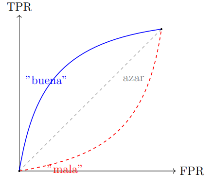
*Figura 20: Curva ROC para tres clasificadores. Cuanto más "arriba a la izquierda" esté la curva, mejor. El AUC del modelo ideal (verde) es 1, del aleatorio (gris) es 0.5.*

---

## 5. Balanceo de clases

En muchos problemas reales las clases están **desbalanceadas**: una clase (la "positiva") aparece con mucha menos frecuencia que la otra. Ejemplos: detección de fraude (fraudes son < 1% de las transacciones), detección de enfermedades raras, churn de clientes.

El desbalance genera problemas:

- La **accuracy** deja de ser una buena métrica.
- Los modelos tienden a predecir siempre la clase mayoritaria.
- El threshold 0.5 deja de ser razonable.

### 5.1. Estrategias a nivel de datos

- **Undersampling** (submuestreo): descartar ejemplos de la clase mayoritaria al azar. Simple pero **pierde información**.
- **Oversampling** (sobremuestreo): replicar ejemplos de la clase minoritaria. Riesgo de **overfitting** porque las copias son idénticas.
- **SMOTE** (*Synthetic Minority Oversampling Technique*): generar **ejemplos sintéticos** de la clase minoritaria interpolando entre vecinos cercanos. Para cada ejemplo minoritario $x_i$ se eligen $k$ vecinos, se sortea uno $x_{nn}$ y se crea un nuevo ejemplo

$$
x_{new} = x_i + \lambda \cdot (x_{nn} - x_i), \qquad \lambda \sim \mathcal{U}(0, 1).
$$

Es la técnica más popular. Variantes: **Borderline-SMOTE** (sólo en la frontera de decisión), **ADASYN** (más ejemplos donde el clasificador es más incierto), **SMOTE + Tomek / SMOTE + ENN** (limpieza de ejemplos ruidosos o solapados).

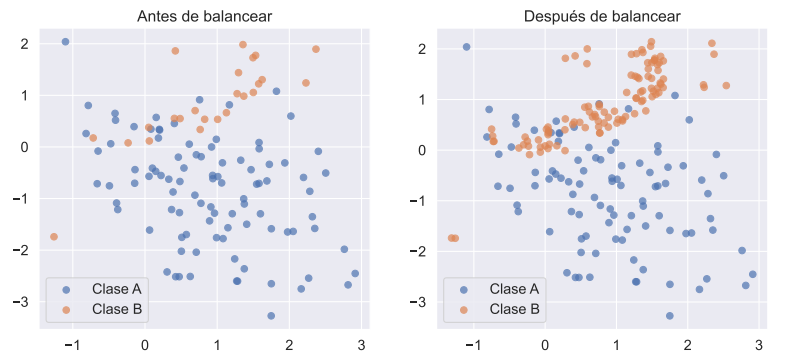
*Figura 21: Izquierda, dataset original desbalanceado. Derecha, dataset balanceado luego de aplicar SMOTE. Los puntos rojos son ejemplos sintéticos generados por interpolación entre vecinos cercanos.*

### 5.2. Estrategias a nivel de modelo

- Asignar **pesos por clase** (*class weights*) en la función de pérdida: que un error en la clase minoritaria "cueste" más. En `scikit-learn` se controla con `class_weight='balanced'`. La pérdida efectiva para el ejemplo $i$ se multiplica por

$$
w_i = \frac{n}{K \cdot n_{y_i}}.
$$

- Cambiar el **umbral de decisión** ($\neq 0.5$): mirar la curva precision-recall o ROC y elegir el umbral que optimiza la métrica de negocio.
- **Cost-sensitive learning**: definir explícitamente una matriz de costos $C$ y minimizar el costo esperado en lugar de la entropía cruzada.

### 5.3. Estrategias a nivel de métricas

- Usar **F1**, **F-beta**, **PR-AUC** (área bajo la curva precision-recall) en lugar de accuracy.
- Reportar la **matriz de confusión** y no sólo un número.
- Si el desbalance es extremo, considerar el problema como **detección de anomalías** (one-class SVM, isolation forest, autoencoders) en lugar de clasificación supervisada clásica.

---

## 6. Explicabilidad de modelos

Un modelo "explicable" es uno cuyas predicciones podemos **interpretar**: entender por qué el modelo predijo lo que predijo. Esto importa por cuestiones regulatorias, éticas, de debugging y de confianza.

### 6.1. Modelos intrínsecamente interpretables

Algunos modelos son interpretables por construcción:

- **Regresión lineal / logística**: los coeficientes $w_j$ cuantifican el efecto de cada feature.
- **Árboles de decisión**: las reglas *if-then-else* son leíbles.
- **Listas de reglas** y **modelos lineales generalizados**.

### 6.2. Modelos de caja negra y técnicas post-hoc

Modelos como gradient boosting, SVM con kernels o redes neuronales son más difíciles de interpretar. Para ellos se usan técnicas post-hoc:

- **Importancia de features** (*permutation importance*, *impurity-based importance*): cuánto cae la métrica si permuto al azar los valores de una feature.
- **Partial Dependence Plots (PDP)**: muestran el efecto marginal de una (o dos) features sobre la predicción promedio

$$
\text{PDP}_j(x_j) = \mathbb{E}_{x_{-j}} \left[ \hat{f}(x_j, x_{-j}) \right].
$$

- **Individual Conditional Expectation (ICE)**: igual que PDP pero una curva por instancia.
- **SHAP** (*SHapley Additive exPlanations*): descompone la predicción de un ejemplo como suma de contribuciones de cada feature, basándose en valores de Shapley de teoría de juegos

$$
\phi_j = \sum_{S \subseteq F \setminus \{j\}} \frac{|S|! \, (|F| - |S| - 1)!}{|F|!} \left[ f(S \cup \{j\}) - f(S) \right].
$$

- **LIME** (*Local Interpretable Model-agnostic Explanations*): aproxima localmente el modelo con un modelo interpretable alrededor de la predicción de un ejemplo particular.
- **Anchors**: reglas del tipo "si estas features cumplen esto, la predicción es X" con alta confianza.
- **Counterfactuales**: "¿qué tendría que cambiar en la entrada para que la predicción fuera otra?". Muy útil en problemas de scoring crediticio o admisión.

### 6.3. Cuidado con la interpretabilidad aparente

Coeficientes de una regresión lineal no siempre son "lo que parecen": pueden cambiar de signo, su importancia puede depender de la escala de las features, y no capturan **interacciones** entre variables. Una variable con coeficiente pequeño en una regresión múltiple puede ser muy influyente en presencia de interacciones.

---

## 7. Comparación de modelos y ajuste fino

### 7.1. *Baseline models*

Siempre hay que tener al menos un **modelo base** (*baseline*) contra el cual comparar:

- **Baseline trivial**: predecir la media (regresión) o la clase mayoritaria (clasificación).
- **Baseline clásico**: regresión logística, árbol de decisión, k-NN, naive Bayes.
- **Baseline "fuerte"**: gradient boosting (XGBoost, LightGBM, CatBoost), SVM, random forest.

Si nuestro modelo "complejo" no le gana al baseline en validación cruzada, **no vale la pena la complejidad**.

### 7.2. Criterios para comparación

- **Métrica de validación** (la que el negocio prioriza).
- **Tiempo de entrenamiento** e **inferencia** (especialmente si vamos a producción con grandes volúmenes).
- **Robustez / estabilidad** entre *folds* de validación cruzada.
- **Interpretabilidad**.
- **Mantenibilidad**: ¿es fácil reentrenarlo cuando llegan datos nuevos? ¿Depende de infraestructura cara?
- **Reproducibilidad**: ¿el resultado depende mucho de la semilla aleatoria? ¿del preprocesamiento?

### 7.3. Sesgo vs varianza

El **sesgo** es el error por hacer suposiciones demasiado simples (underfitting). La **varianza** es el error por ser demasiado sensible a los datos de entrenamiento (overfitting).

Formalmente, la **descomposición sesgo-varianza** del error esperado de un modelo $\hat{f}$ en un punto $x$ es

$$
\mathbb{E}\left[ (y - \hat{f}(x))^2 \right] = \underbrace{\text{Bias}^2(\hat{f}(x))}_{\text{error por simplificación}} + \underbrace{\text{Var}(\hat{f}(x))}_{\text{error por sensibilidad a los datos}} + \underbrace{\sigma^2}_{\text{ruido irreducible}}.
$$


*Figura 4: Cuatro regímenes posibles de sesgo y varianza. La figura muestra dardos alrededor de un blanco (la verdad). Arriba-izquierda: bajo sesgo y baja varianza (modelo ideal). Arriba-derecha: bajo sesgo y alta varianza. Abajo-izquierda: alto sesgo y baja varianza. Abajo-derecha: alto sesgo y alta varianza.*

- Un modelo con **alto sesgo y baja varianza** (subajuste): anduvo mal en train, mal en test, similar en ambos.
- Un modelo con **bajo sesgo y alta varianza** (sobreajuste): anduvo muy bien en train, mal en test.

El objetivo es encontrar el balance: complejidad suficiente para capturar el patrón subyacente, pero no tanta como para memorizar ruido.


*Figura 5: Tradeoff sesgo-varianza en función de la complejidad del modelo. El error total es la suma del sesgo y la varianza. A medida que crece la complejidad, el sesgo baja pero la varianza sube. El óptimo está en el punto donde se minimiza el error total.*

### 7.4. Diagnóstico de overfitting y underfitting

Para diagnosticar:

- **Curvas de aprendizaje** (*learning curves*): graficar la métrica en train y validation a medida que crece el tamaño del train set.
  - Si train y validation convergen a un valor alto → **underfitting** (subajuste). Hace falta un modelo más expresivo o mejores features.
  - Si hay una brecha grande entre train (bajo) y validation (alto) → **overfitting** (sobreajuste). Hay que regularizar, juntar más datos, o reducir complejidad.

---

## 8. Ajuste fino

### 8.1. Optimización de hiperparámetros

Los **hiperparámetros** son parámetros del algoritmo de aprendizaje que **no** se ajustan por gradiente descendiente: la profundidad máxima de un árbol, el número de vecinos en k-NN, la fuerza de regularización $\lambda$, etc.

Para elegirlos, no podemos usar el train set (sobreajustaríamos) ni el test set (lo "gastamos" como estimador final). Usamos el **validation set** o **validación cruzada**.

### 8.2. Métodos de búsqueda

- **Grid search**: probar todas las combinaciones de valores de una grilla predefinida. Simple pero costoso. Mejor cuando hay pocos hiperparámetros.
- **Random search**: muestrear combinaciones al azar. Sorprendentemente competitivo contra grid search en espacios de alta dimensionalidad, según Bergstra & Bengio (2012).
- **Bayesian optimization** (e.g. `Optuna`, `Hyperopt`, `scikit-optimize`): construir un modelo probabilístico de la función objetivo y elegir los próximos puntos a evaluar maximizando un criterio de *expected improvement*. Mucho más eficiente que grid/random.
- **Hyperband / BOHB**: métodos que combinan búsqueda con *early stopping* para descartar configuraciones malas rápidamente.
- **Population Based Training (PBT)**: combina búsqueda con entrenamiento. Útil en redes neuronales grandes.

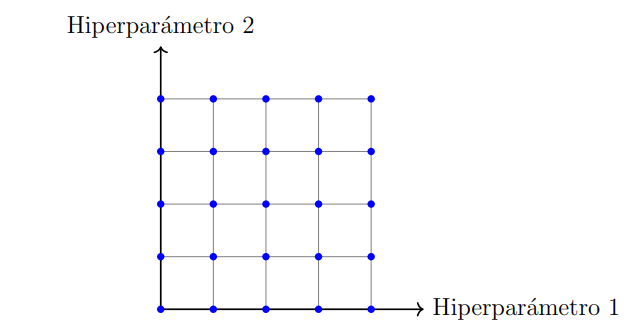
*Figura 22: Ilustración de grid search sobre dos hiperparámetros. Se prueban todas las combinaciones de la grilla; en cada celda queda registrada la métrica (color). Cuesta $k_1 \times k_2$ entrenamientos.*

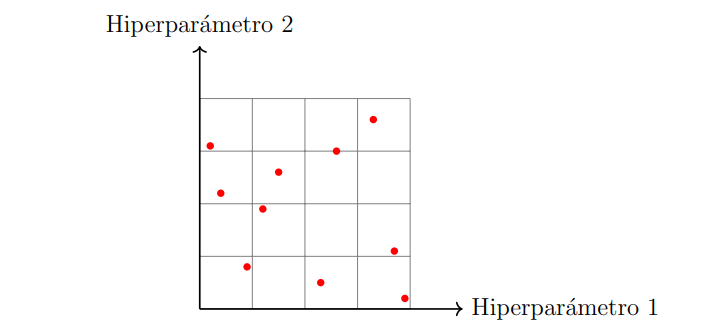
*Figura 23: Random search muestrea $N$ combinaciones al azar en el espacio de búsqueda. Cuando sólo unos pocos hiperparámetros importan, explorar más a lo largo de esos ejes suele encontrar buenas configuraciones con menos presupuesto que grid.*

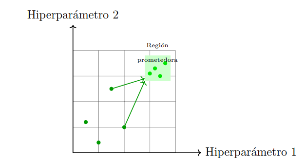
*Figura 24: Optimización bayesiana: a la izquierda, un modelo probabilístico (e.g. *Gaussian Process*) aproxima la función objetivo a partir de las evaluaciones previas. A la derecha, una función de adquisición (e.g. *Expected Improvement*) elige el próximo punto a evaluar. Cada nueva observación mejora el modelo surrogate.*

### 8.3. Validación cruzada anidada

Si usamos validación cruzada para ajustar hiperparámetros y volvemos a usar validación cruzada para estimar el desempeño, necesitamos **dos loops anidados** de CV. El loop interno elige los hiperparámetros, el loop externo estima el desempeño. Si no, la estimación de desempeño está **optimista**.

---

## 9. Introducción a redes neuronales

### 9.1. Del ML clásico al *deep learning*

En los modelos clásicos (regresión, árboles, SVM) las features las **define a mano** un humano. En *deep learning*, las features se **aprenden** automáticamente a partir de los datos. Cada capa aprende una representación cada vez más abstracta: bordes → texturas → partes → objetos. Esto funciona muy bien cuando tenemos **muchos datos** y la extracción manual de features es difícil (imágenes, audio, texto).

### 9.2. El problema XOR y por qué los modelos lineales no alcanzan

El **XOR** es el ejemplo canónico de un problema que un modelo lineal no puede resolver. La tabla de verdad es

| $x_1$ | $x_2$ | $y$ |
|---|---|---|
| 0 | 0 | 0 |
| 0 | 1 | 1 |
| 1 | 0 | 1 |
| 1 | 1 | 0 |

Cualquier recta que intente separar las dos clases va a fallar en al menos un punto. Un modelo lineal lo confirmamos: si ajustamos $\hat{y} = w_1 x_1 + w_2 x_2 + b$ por mínimos cuadrados, la mejor solución es $w_1 = w_2 = 0$, $b = 0.5$, es decir $\hat{y} = 0.5$ para todo $\mathbf{x}$, que clasifica todo como la misma clase.

La solución de las redes neuronales es **componer** funciones no lineales. Por ejemplo, una red de dos capas puede aprender la frontera XOR:

$$
\hat{y} = f(w_5 \cdot f(w_1 x_1 + w_2 x_2 + b_1) + w_6 \cdot f(w_3 x_1 + w_4 x_2 + b_2) + b_3).
$$

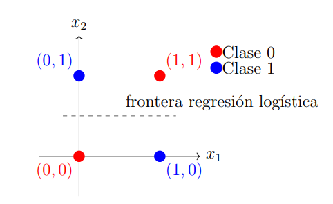
*Figura 25: El problema XOR en 2D. No existe una recta que separe los puntos con $y = 1$ de los puntos con $y = 0$. Un modelo lineal va a fallar siempre. Una red neuronal con una capa oculta puede aprender la frontera combinando dos rectas (una OR interna y una AND final).*

### 9.3. La neurona artificial (*perceptrón*)

El **perceptrón** es la unidad básica de una red neuronal. Calcula una combinación lineal de las entradas, le suma un sesgo y la pasa por una **función de activación** no lineal $\phi$:

$$
h = \phi\left( \sum_{j=1}^d w_j x_j + b \right) = \phi(\mathbf{w}^T \mathbf{x} + b).
$$

Funciones de activación comunes: step, sigmoide, tanh, ReLU ($\max(0, z)$), Leaky ReLU, GELU, Swish.

### 9.4. Perceptrón multicapa (*MLP*)

Un **MLP** es la composición de varias capas de perceptrones. Una capa "fully connected" con $m$ neuronas hace:

$$
\mathbf{h}^{(l)} = \phi\left( W^{(l)} \mathbf{h}^{(l-1)} + \mathbf{b}^{(l)} \right),
$$

con $W^{(l)} \in \mathbb{R}^{m \times d}$, donde $d$ es la dimensión de la capa anterior. Apilando muchas capas logramos una **función muy flexible** que puede aproximar casi cualquier función continua (teorema de aproximación universal).

En forma componente a componente, para la neurona $j$ de la capa $l$:

$$
z_j^{(l)} = \sum_{i=1}^{n_{l-1}} w_{ji}^{(l)} a_i^{(l-1)} + b_j^{(l)}, \qquad
a_j^{(l)} = g^{(l)}(z_j^{(l)}),
$$

donde $g^{(l)}$ es la función de activación de la capa $l$ y $a^{(0)} = \mathbf{x}$ es la entrada. En forma matricial:

$$
\mathbf{z}^{(l)} = W^{(l)} \mathbf{a}^{(l-1)} + \mathbf{b}^{(l)}, \qquad
\mathbf{a}^{(l)} = g^{(l)}(\mathbf{z}^{(l)}).
```

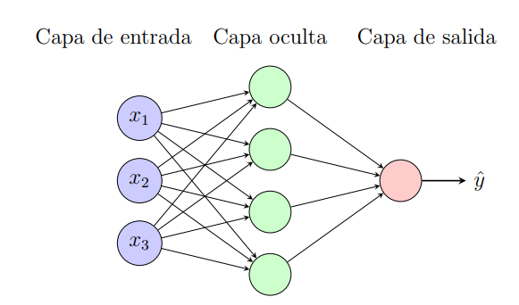
*Figura 27: Un MLP feed-forward con una capa de entrada de $d$ neuronas, dos capas ocultas de $m_1$ y $m_2$ neuronas y una capa de salida. Cada flecha representa un peso $w_{ji}^{(l)}$ y cada nodo un sesgo $b_j^{(l)}$; la salida de cada neurona se pasa por la función de activación $g^{(l)}$ de la capa.*

### 9.5. Entrenamiento de una red neuronal

El entrenamiento de una red neuronal es un problema de optimización **no convexo**: la función de pérdida tiene muchos mínimos locales. En la práctica:

- Se inicializan los pesos al azar (rompiendo la simetría).
- Se entrena con **gradiente descendiente estocástico** (SGD) o variantes (Adam, RMSProp).
- Se itera sobre **épocas**: una época es una pasada completa por el dataset (o por todos los mini-batches).
- Se monitorea la pérdida en train y en validation para detectar overfitting.

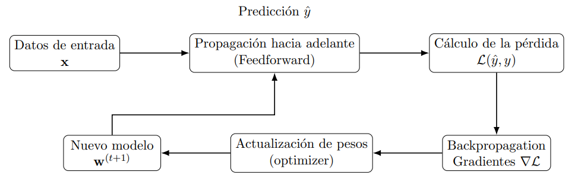
*Figura 26: Ciclo de entrenamiento de una red neuronal. En cada iteración se toma un mini-batch del dataset, se hace un forward pass para calcular la pérdida, un backward pass para calcular gradientes y se actualizan los pesos con el optimizador. La pérdida se monitorea en train y validation para decidir cuándo parar.*

### 9.6. Funciones de pérdida

Las pérdidas más usadas son:

- **Regresión:** MSE

$$
L = \frac{1}{n} \sum_{i=1}^n (y_i - \hat{y}_i)^2.
$$

- **Clasificación binaria:** binary cross-entropy (entropía cruzada binaria, vista en §3.7).
- **Clasificación multiclase:** categorical cross-entropy (entropía cruzada categórica, vista en §3.8).

### 9.7. Optimizadores

Las actualizaciones de los pesos en la iteración $t$ son variantes de la regla general

$$
\theta^{(t+1)} = \theta^{(t)} - \eta \cdot \text{update}(\theta^{(t)}).
$$

Las variantes más usadas son:

- **SGD**:

$$
\theta^{(t+1)} = \theta^{(t)} - \eta \nabla_\theta L^{(t)}.
$$

- **SGD con momentum**:

$$
v^{(t+1)} = \mu v^{(t)} + \nabla_\theta L^{(t)}, \qquad
\theta^{(t+1)} = \theta^{(t)} - \eta v^{(t+1)}.
$$

- **Adagrad**: escala el learning rate por feature, acumulando gradientes al cuadrado

$$
G^{(t+1)} = G^{(t)} + (\nabla_\theta L^{(t)})^2, \qquad
\theta^{(t+1)} = \theta^{(t)} - \frac{\eta}{\sqrt{G^{(t+1)} + \epsilon}} \nabla_\theta L^{(t)}.
$$

- **RMSProp**: igual que Adagrad pero usa una media móvil exponencial para no decaer demasiado rápido

$$
G^{(t+1)} = \beta G^{(t)} + (1 - \beta)(\nabla_\theta L^{(t)})^2, \qquad
\theta^{(t+1)} = \theta^{(t)} - \frac{\eta}{\sqrt{G^{(t+1)} + \epsilon}} \nabla_\theta L^{(t)}.
$$

- **Adam** (*Adaptive Moment Estimation*): combina momentum + RMSProp

$$
m^{(t+1)} = \beta_1 m^{(t)} + (1 - \beta_1) \nabla_\theta L^{(t)},
$$
$$
v^{(t+1)} = \beta_2 v^{(t)} + (1 - \beta_2)(\nabla_\theta L^{(t)})^2,
$$
$$
\hat{m} = \frac{m^{(t+1)}}{1 - \beta_1^{t+1}}, \qquad
\hat{v} = \frac{v^{(t+1)}}{1 - \beta_2^{t+1}},
$$
$$
\theta^{(t+1)} = \theta^{(t)} - \eta \cdot \frac{\hat{m}}{\sqrt{\hat{v}} + \epsilon}.
$$

Valores típicos: $\beta_1 = 0.9$, $\beta_2 = 0.999$, $\epsilon = 10^{-8}$. Adam es el optimizador por defecto en la mayoría de las aplicaciones modernas.

### 9.8. *Backpropagation*

**Backpropagation** es el algoritmo que permite calcular los gradientes de la pérdida respecto a todos los pesos de la red, capa por capa, usando la regla de la cadena. Consta de dos pasos:

1. **Forward pass:** dado $\mathbf{x}$, calcular las activaciones capa por capa hasta la salida $\hat{y}$ y la pérdida $L$.
2. **Backward pass:** propagar el gradiente $\partial L / \partial \hat{y}$ hacia atrás capa por capa, calculando $\partial L / \partial W^{(l)}$ y $\partial L / \partial b^{(l)}$ para cada $l$.

Para la **última capa** $L$, el "error" por neurona es

$$
\delta_j^{(L)} = \frac{\partial C}{\partial a_j^{(L)}} \cdot g'^{(L)}(z_j^{(L)}).
$$

Para una **capa oculta** $l$:

$$
\delta_j^{(l)} = \left( \sum_{k=1}^{n_{l+1}} w_{kj}^{(l+1)} \delta_k^{(l+1)} \right) \cdot g'^{(l)}(z_j^{(l)}).
$$

Los gradientes respecto a los parámetros son

$$
\frac{\partial C}{\partial w_{ji}^{(l)}} = a_i^{(l-1)} \delta_j^{(l)}, \qquad
\frac{\partial C}{\partial b_j^{(l)}} = \delta_j^{(l)}.
$$

En forma matricial compacta:

$$
\delta^{(l)} = (W^{(l+1)})^T \delta^{(l+1)} \odot g'^{(l)}(\mathbf{z}^{(l)}),
$$
$$
\nabla_{W^{(l)}} C = \delta^{(l)} (\mathbf{a}^{(l-1)})^T, \qquad
\nabla_{\mathbf{b}^{(l)}} C = \delta^{(l)},
$$

donde $\odot$ denota el producto elemento a elemento (*Hadamard*).

Una vez calculados los gradientes, se aplica **gradiente descendiente** (o una variante como Adam) para actualizar los pesos.

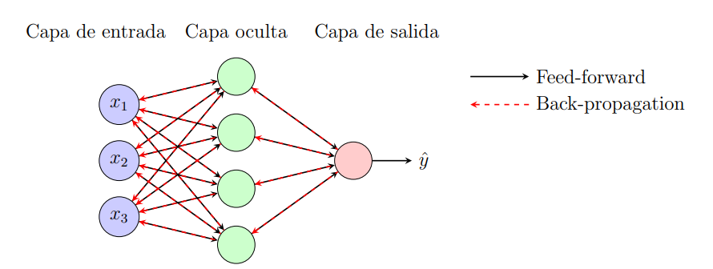
*Figura 28: Flujo del cálculo en una red neuronal. En el *forward pass* (flechas negras) se calculan las activaciones capa por capa hasta la pérdida. En el *backward pass* (flechas rojas) el error $\delta$ se propaga hacia atrás capa por capa, calculando los gradientes respecto a los pesos y sesgos de cada capa.*

### 9.9. Inicialización de pesos

Inicializar todos los pesos a cero no funciona: todas las neuronas de una capa computarían lo mismo. Con inicialización aleatoria **rompemos la simetría**. Buenas prácticas:

- **Xavier / Glorot**: $\mathcal{U}(-1/\sqrt{d}, 1/\sqrt{d})$. Para tanh, sigmoid.
- **He**: $\mathcal{N}(0, 2/d)$. Para ReLU y variantes.

### 9.10. *Batch normalization*

**Batch normalization** (Ioffe & Szegedy, 2015) normaliza las activaciones de una capa a media 0 y varianza 1 (por mini-batch) y luego aplica una transformación afín aprendible:

$$
\hat{h}_j = \gamma_j \frac{h_j - \mu_j}{\sqrt{\sigma_j^2 + \epsilon}} + \beta_j.
$$

Efectos: estabiliza el entrenamiento, permite tasas de aprendizaje más altas, y actúa como regularizador. En inferencia se usan $\mu$ y $\sigma$ acumulados durante el entrenamiento.

### 9.11. Funciones de activación

- **Step** (escalón): $\phi(z) = \mathbb{1}\{z \geq 0\}$. Histórica, no derivable.
- **Sigmoide**: $\sigma(z) = 1/(1 + e^{-z})$. Salida en $(0, 1)$, derivada pequeña para $|z|$ grande (vanishing gradient).
- **Tanh**: $\tanh(z)$. Salida en $(-1, 1)$, centrada en 0, mismo problema de saturación.
- **ReLU**: $\phi(z) = \max(0, z)$. Simple, rápida, no satura para $z > 0$. Es la más usada.
- **Leaky ReLU**: $\phi(z) = \max(\alpha z, z)$, $\alpha \approx 0.01$. Evita "neuronas muertas".
- **GELU / Swish**: aproximaciones suaves, populares en transformers.

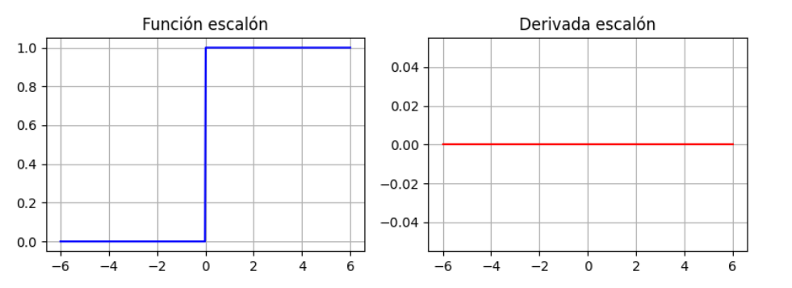
*Figura 29: Función escalón $\phi(z) = \mathbb{1}\{z \geq 0\}$. Es la activación original del perceptrón de Rosenblatt (1958). No es derivable en $z=0$, lo que impide usarla con gradiente descendiente. Por eso en redes modernas se usan activaciones suaves.*

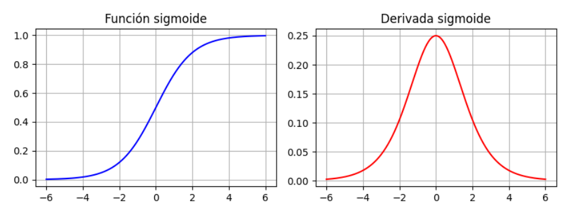
*Figura 30: Función sigmoide $\sigma(z) = 1/(1+e^{-z})$ y su derivada $\sigma'(z) = \sigma(z)(1-\sigma(z))$. La derivada satura a 0 cuando $|z|$ crece, lo que provoca el problema de *vanishing gradient* en redes profundas.*

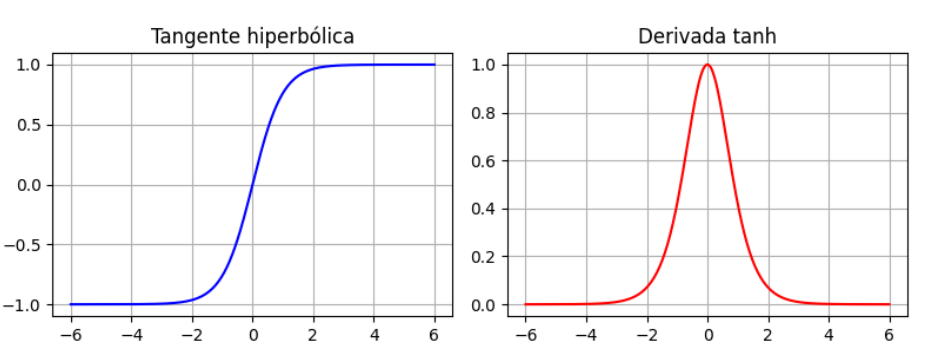
*Figura 31: Función $\tanh(z)$ y su derivada $1 - \tanh^2(z)$. A diferencia de la sigmoide, $\tanh$ está centrada en 0 (rango $(-1, 1)$), lo que en la práctica hace converger más rápido al SGD. Pero también satura para $|z|$ grande.*

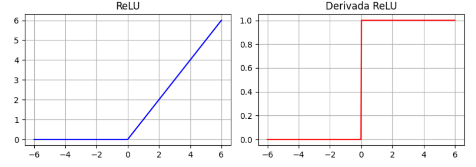
*Figura 32: ReLU $\phi(z) = \max(0, z)$ y su derivada $\phi'(z) = \mathbb{1}\{z > 0\}$. Computacionalmente muy barata, no satura para $z > 0$, y su derivada es 0 ó 1 — no explota. Problema: las "neuronas muertas" (que caen en $z \leq 0$) dejan deactualizarse. Es la activación por defecto en la mayoría de las redes modernas.*

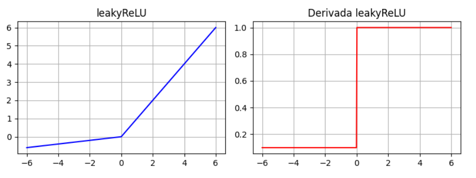
*Figura 33: Leaky ReLU $\phi(z) = \max(\alpha z, z)$ con $\alpha \approx 0.01$ y su derivada. La pequeña pendiente $\alpha$ para $z < 0$ evita las neuronas muertas de ReLU, manteniendo un gradiente no nulo.*

### 9.12. Regularización en redes neuronales

#### 9.12.1. Penalizaciones de norma

Igual que en regresión: L1, L2 o ElasticNet sobre los pesos. En deep learning se usa más L2 (a veces llamado *weight decay*).

#### 9.12.2. *Early stopping*

**Early stopping**: monitorear la pérdida en validation; si deja de mejorar durante $k$ épocas consecutivas (*patience*), parar el entrenamiento y quedarse con los mejores pesos. Es una forma "gratis" de regularización.

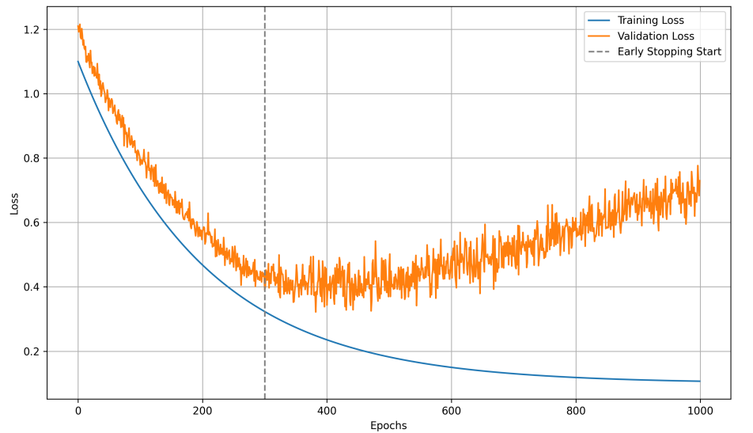
*Figura 34: Curvas típicas de train (azul) y validation (naranja). La pérdida en train sigue bajando monótonamente, pero la de validation tiene un mínimo en la época ~30 y luego empieza a subir: ahí comienza el overfitting. Con early stopping, en ese momento restauramos los pesos del mínimo de validation y detenemos el entrenamiento.*

#### 9.12.3. *Data augmentation*

Generar ejemplos nuevos a partir de los existentes: rotaciones, recortes, zoom, ruido, mezclas. Es la regularización más efectiva en visión y audio.

#### 9.12.4. *Dropout*

**Dropout** (Srivastava et al., 2014) "apaga" cada neurona con probabilidad $p$ en cada paso de entrenamiento. En inferencia, todas las neuronas están activas y se escalan los pesos por $(1 - p)$ (o equivalentemente se multiplican por $p$ durante entrenamiento, lo que se llama *inverted dropout*). Equivale a entrenar un ensemble de sub-redes; es un regularizador muy efectivo. En forma funcional, durante entrenamiento la salida de la capa es

$$
\mathbf{h}^{(l)} = g^{(l)}(W^{(l)} \mathbf{a}^{(l-1)} + \mathbf{b}^{(l)}) \odot \mathbf{m}^{(l)}, \quad
m_i^{(l)} \sim \text{Bernoulli}(1 - p).
$$

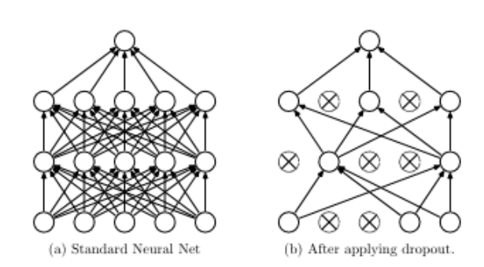
*Figura 35: Izquierda, **dropout estándar**: en inferencia se multiplican los pesos por $(1-p)$ para compensar que en entrenamiento sólo un $(1-p)$ fracción estaba activo. Derecha, **inverted dropout**: durante entrenamiento se divide por $(1-p)$ la salida, de modo que en inferencia no hace falta reescalar. Es la convención adoptada por la mayoría de los frameworks.*

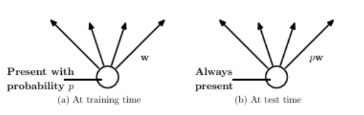
*Figura 36: Izquierda, **training time**: cada neurona se "apaga" con probabilidad $p$ en cada forward pass, lo que obliga a la red a no depender de ninguna neurona individual. Derecha, **test time**: todas las neuronas están activas y se usan los pesos ya compensados por inverted dropout.*

#### 9.12.5. *Batch normalization*

Vista en §9.10: además de acelerar el entrenamiento, tiene un efecto regularizador.

#### 9.12.6. *Label smoothing*

Reemplazar el one-hot $(0, 1)$ por algo como $(0.05, 0.95)$ en la target. Reduce la confianza excesiva del modelo y mejora la calibración.

### 9.13. *Vanishing / exploding gradients*

En redes profundas, los gradientes pueden **explotar** (crecer sin control) o **desaparecer** (tender a cero) al propagarse hacia atrás. Causas: funciones de activación con derivada pequeña (sigmoid, tanh), inicialización pobre, multiplicación repetida de matrices.

Soluciones modernas: ReLU + inicialización He + batch normalization + conexiones residuales (ResNet) + LSTM/GRU para secuencias.

### 9.14. *Transfer learning*

**Transfer learning** consiste en tomar una red pre-entrenada en un dataset grande (e.g. ImageNet) y **adaptarla** a nuestro problema. Dos variantes:

- **Feature extraction:** congelamos las capas convolucionales y sólo entrenamos un clasificador nuevo encima.
- **Fine-tuning:** descongelamos algunas (o todas) las capas y las reentrenamos con tasa de aprendizaje baja.

Funciona porque las primeras capas de las redes profundas aprenden **features genéricas** (bordes, texturas, formas) que son útiles para muchas tareas visuales.

### 9.15. *Embeddings*

Un **embedding** es una representación densa y de baja dimensionalidad de una variable categórica (palabras, productos, usuarios, IDs). Se aprende por backpropagation junto con el resto de la red. Las entidades similares quedan "cerca" en el espacio de embedding. Es la base de los sistemas de recomendación y de los modelos de lenguaje (Word2Vec, GloVe, BERT).

### 9.16. Frameworks

- **TensorFlow / Keras:** alto nivel, producción, ecosistema Google.
- **PyTorch:** más "pythónico", investigación, preferido en academia.
- **JAX:** diferenciación automática + compilación XLA, popular en investigación reciente.

---

## 10. MLOps

**MLOps** (*Machine Learning Operations*) es la disciplina de llevar modelos de ML a **producción de forma confiable, reproducible y mantenible**. Abarca desde versionado de datos hasta monitoreo en producción.

### 10.1. Entornos de Desarrollo y Producción

El **entorno de desarrollo** es donde se entrena y experimenta: usualmente un *notebook* o un script Python con datos históricos completos. El **entorno de producción** es donde el modelo genera predicciones **en vivo** para usuarios o sistemas downstream. Las dos brechas más comunes:

- **Training-serving skew:** diferencias entre cómo se preprocesa en train vs en producción. Por ejemplo, una feature que en train es estática pero en producción cambia de significado con el tiempo.
- **Data drift:** la distribución de los datos de producción se aleja de la distribución de entrenamiento. Puede ser **covariate shift** (cambia $P(X)$ pero no $P(Y \mid X)$) o **concept drift** (cambia $P(Y \mid X)$).

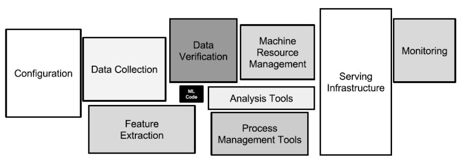
*Figura 37: Componentes típicos de un sistema de ML en producción. Los datos crudos pasan por un pipeline de preprocesamiento, se almacenan en un *feature store*, alimentan al modelo entrenado, y las predicciones se sirven a través de una API. Todo el flujo se monitorea continuamente y se reentrena periódicamente.*

### 10.2. Monitoreo y mantenimiento

Un modelo en producción **se degrada con el tiempo**. Monitoreamos:

- **Métricas operacionales:** latencia, throughput, tasa de error de predicción.
- **Métricas de input:** distribución de las features de entrada. Si cambian, hay *data drift*.
- **Métricas de output:** distribución de las predicciones. Si cambia bruscamente, hay algo raro.
- **Métricas de negocio** (con retardo): ¿las predicciones del modelo siguen mejorando la métrica de negocio?
- **Feedback loop:** cuando es posible, juntar etiquetas reales de las predicciones (e.g. el usuario aceptó o no la recomendación) y reentrenar periódicamente.

### 10.3. Niveles de MLOps

Adaptado de Google (Treveil et al., 2020):

- **Nivel 0 — Manual:** notebooks, scripts ad-hoc, deployments a mano. El release del modelo es un proceso manual. Sirve para experimentar pero no escala.
- **Nivel 1 — ML pipeline automatizado:** el reentrenamiento se dispara automáticamente cuando hay datos nuevos. Hay un pipeline reproducible pero el release del modelo sigue siendo manual.
- **Nivel 2 — CI/CD pipeline completo:** integración y despliegue continuo del código, datos y modelo. Tests automatizados, versionado de artefactos, retraining continuo.

Subir de nivel requiere infraestructura: orquestadores (Airflow, Prefect, Dagster, Kubeflow), registries de modelos (MLflow, Vertex AI, SageMaker), feature stores, y prácticas de ingeniería de software (tests, versionado, code review).

### 10.4. Reproducibilidad

Para que un experimento sea reproducible:

- **Versionar el código** (git).
- **Versionar los datos** (DVC, lakeFS, Pachyderm).
- **Fijar las versiones de las librerías** (`requirements.txt`, `pip freeze`, Docker).
- **Guardar los hiperparámetros** y la semilla aleatoria (*random seed*).
- **Documentar** el pipeline.

### 10.5. Versionado de modelos y feature stores

- **Model registry**: lugar central donde se guardan los modelos entrenados con sus metadatos (métricas, hiperparámetros, autor, fecha, dataset usado). Ejemplos: MLflow Model Registry, Vertex AI Model Registry.
- **Feature store**: capa que centraliza y versiona las features usadas en entrenamiento y en inferencia, garantizando consistencia entre train y serve. Ejemplos: Feast, Tecton, Hopsworks.

---

## Bibliografía

- Bishop, C. M. (2006). *Pattern Recognition and Machine Learning*. Springer.
- Hastie, T., Tibshirani, R., Friedman, J. (2009). *The Elements of Statistical Learning*. Springer. [2da ed., disponible online].
- Goodfellow, I., Bengio, Y., Courville, A. (2016). *Deep Learning*. MIT Press. [disponible online].
- Géron, A. (2022). *Hands-On Machine Learning with Scikit-Learn, Keras, and TensorFlow*. O'Reilly. [3rd ed.]
- Chollet, F. (2021). *Deep Learning with Python*. Manning. [2nd ed.]
- Bergstra, J., Bengio, Y. (2012). *Random Search for Hyper-Parameter Optimization*. JMLR.
- Ioffe, S., Szegedy, C. (2015). *Batch Normalization*. ICML.
- Srivastava, N. et al. (2014). *Dropout: A Simple Way to Prevent Neural Networks from Overfitting*. JMLR.
- Treveil, M. et al. (2020). *Introducing MLOps*. O'Reilly.
- Spak, J. (2025). *Apunte de Aprendizaje Automático 1*. FCEIA — UNR.

---

> *Última revisión: Agosto 2025 — Autor: Esp. Ing. Joel Spak.*
